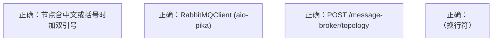
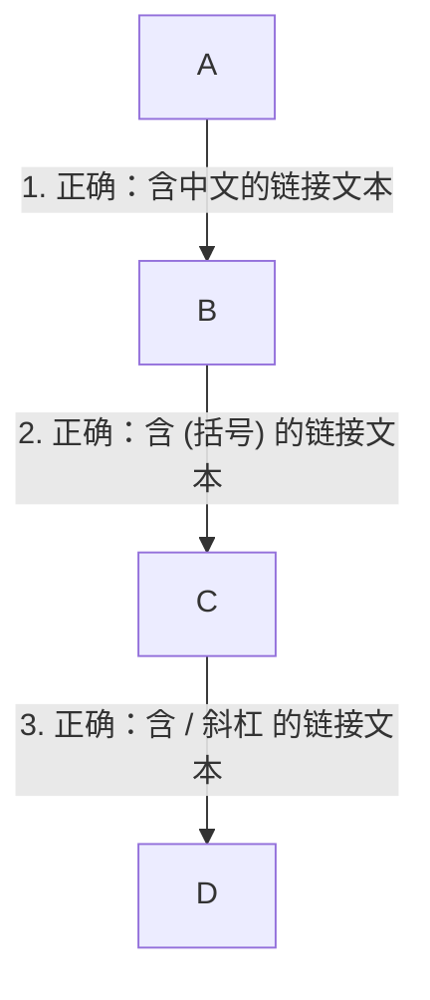
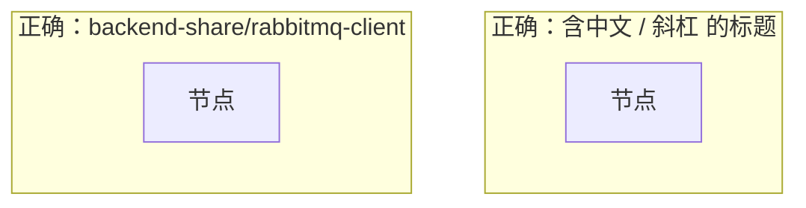
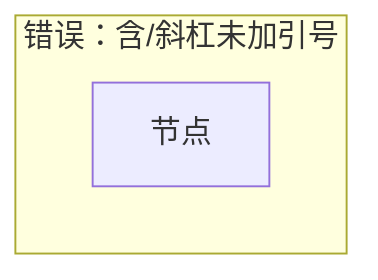
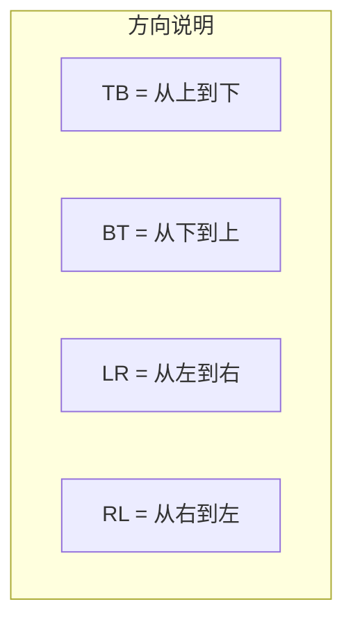

# 技能：Mermaid 图语法规范 (create-md-skill)

本规范适用于 `digital-employee` 仓库下所有 Markdown 文档中的 Mermaid 图。
基于 Mermaid 9.3.0（当前 IDE 内置版本）。

## 1. 核心原则：有特殊字符必加双引号

Mermaid 使用方括号 `[]`、圆括号 `()`、花括号 `{}` 等字符作为形状语法标记。
**只要节点/链接文本包含以下任一字符，必须用双引号包裹：**

```
()  []  {}  <>  /  \  :  ;  ,  .  ?  ！  ？  【  】
中文 空格 Tab  &  #  *  +  =  |  %  $  @  !  ~  ^
```

### 1.1 节点标签



**错误写法（会报 Parse error）：**
```mermaid
graph TB
    A[错误：节点含(括号)未加引号]
```

### 1.2 节点形状与引号规则

| 形状 | 语法 | 注意事项 |
| :--- | :--- | :--- |
| 矩形 | `A["text"]` | 即使 text 无特殊字符，也建议加引号保持统一 |
| 圆角矩形 | `A("text")` | 外层 `()` 是形状语法，text 内若有 `()` 仍需加引号：`A("text (with parens)")` |
| 圆柱（数据库） | `A[("text")]` | 外层 `[()]` 是形状语法，text 内若有括号需嵌套引号：`A[("Queue: (primary)")]` |
| 菱形（判断） | `A{"text"}` | 外层 `{}` 是形状语法 |
| 六边形 | `A{{"text"}}` | 外层 `{{}}` 是形状语法 |

### 1.3 链接文本

**一律使用 `|"text"|` 格式（双引号包裹）：**



**错误写法：**
```mermaid
graph TB
    A -->|错误：含中文未加引号| B
    A -->|也错误：含(括号)未加引号| C
```

### 1.4 Subgraph 标题



**错误写法：**


## 2. Mermaid 9.3.0 语法速查

### 2.1 节点形状

| 语法 | 形状 | 示例 |
| :--- | :--- | :--- |
| `A["text"]` | 矩形 | 最常用 |
| `A("text")` | 圆角矩形 | 开始/结束 |
| `A[("text")]` | 圆柱 | 数据库/队列 |
| `A{"text"}` | 菱形 | 判断分支 |
| `A>"text"]` | 旗帜 | 异步/输出 |
| `A[/"text"/]` | 平行四边形 | 输入/输出 |
| `A["text"]` | 六边形 | 预备/条件 |

### 2.2 连线样式

| 语法 | 说明 |
| :--- | :--- |
| `A --> B` | 实线箭头 |
| `A -.-> B` | 虚线箭头 |
| `A ===> B` | 粗线箭头 |
| `A -- B` | 实线无箭头 |
| `A --- B` | 实线无箭头（等价） |
| `A -.- B` | 虚线无箭头 |
| `A ==> B` | 粗线无箭头 |

### 2.3 子图方向



## 3. 常见陷阱与排查

### 3.1 括号陷阱

**问题**：`Client[RabbitMQClient (aio-pika)]` → Mermaid 将 `(aio-pika)` 解析为圆角矩形形状，导致语法错误。

**修复**：`Client["RabbitMQClient (aio-pika)"]`

### 3.2 斜杠陷阱

**问题**：`subgraph Share [backend-share/rabbitmq-client]` → `/` 被解析为语法符号。

**修复**：`subgraph Share ["backend-share/rabbitmq-client"]`

### 3.3 中文陷阱

**问题**：`A[发布上行消息]` → 中文不会直接影响解析，但含中文时通常也伴随其他特殊字符。

**建议**：含中文的节点标签和链接文本一律加双引号。

### 3.4 换行符

**正确用法**：`A["第一行<br/>第二行"]` — 使用 `<br/>` 标签换行。

**注意**：不要在 `[]` 外直接使用 `<br/>`，Mermaid 会将其解析为 HTML 标签。

### 3.5 冒号与花括号

**问题**：`A["Exchange: {name: value}"]` → 花括号和冒号在 Mermaid 中可能被解析为样式定义。

**修复**：花括号和冒号内容必须加双引号。

## 4. 检查清单

生成 Mermaid 图后，逐项检查：

- [ ] 所有节点标签中特殊字符（括号、斜杠、中文、冒号等）用双引号包裹
- [ ] 所有链接文本用 `|"text"|` 格式，而非 `|text|`
- [ ] subgraph 标题中的特殊字符用双引号包裹
- [ ] 图方向正确（`TB`/`BT`/`LR`/`RL`）
- [ ] 连线类型正确（`-->`/`-.->`/`==>`）