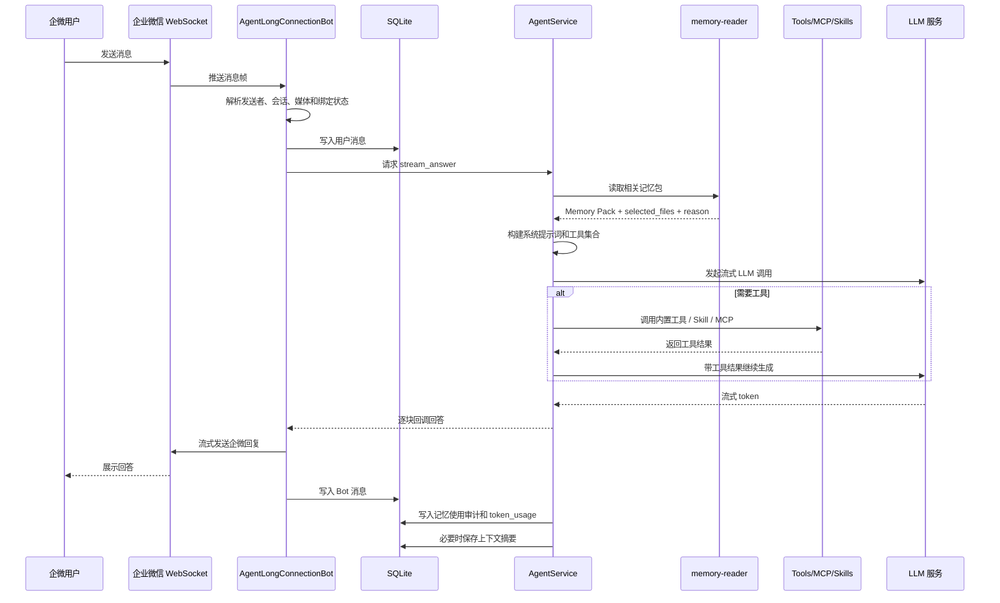
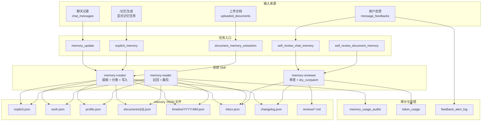
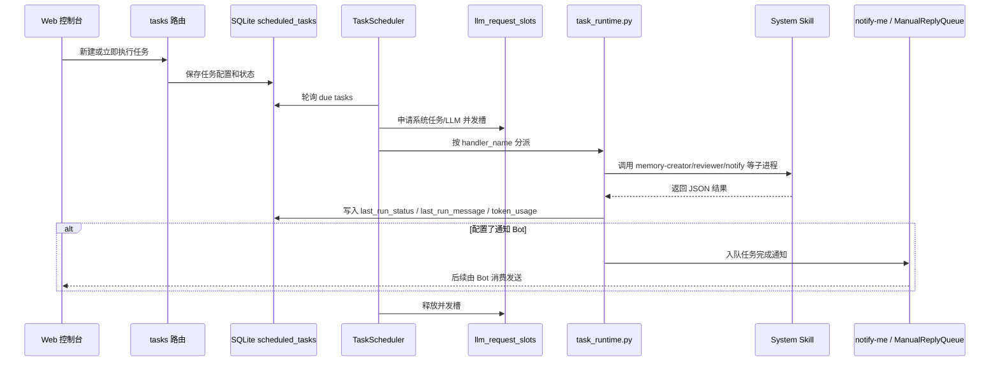

# WeCom Bot Agent 项目架构图

## 读图说明

这份文档描述系统运行边界和模块协作。模型只作为外部 LLM 服务出现在图中；模型字段、模型列表和配置入口以 README 和控制台为准。

系统有两种主要运行形态：

- Web 控制台进程：负责配置、数据管理、任务管理、Bot 进程生命周期和前端页面。
- Bot 子进程：通过企业微信 WebSocket 接收消息，调用 Agent Runtime，并把回答流式发回企业微信。

数据也分成两类：

- SQLite：保存配置、账号、会话、消息、任务、日志、审计、反馈、Token 用量和并发槽位等运行时数据。
- `.memory/` JSON 文件：保存长期记忆本体，包括显式记忆、工作记忆、文档记忆、时间线、收件箱和审查报告。

## 系统总览

```mermaid
graph TB
    subgraph ENTRY["入口层"]
        MAIN["main.py<br/>启动参数分发"]
    end

    subgraph WEB["Web 管理控制台"]
        WEB_SERVER["web_server.py<br/>FastAPI + SPA 挂载"]
        ROUTERS["routers/<br/>Agent/Bot/Chat/Task/Data/Auth 等 API"]
        VUE["web/<br/>Vue 3 + Element Plus"]
        AUTH["auth.py / auth_middleware.py<br/>控制台登录与权限"]
        BPM["bot_process_manager.py<br/>Bot 子进程管理"]
        WATCHDOG["watchdog.py<br/>进程看门狗"]
    end

    subgraph BOT["企微 Bot 子进程"]
        LONG_CONN["long_connection.py<br/>AgentLongConnectionBot"]
        WECOM_WS["wecom_aibot_sdk<br/>WebSocket 客户端"]
        HANDLERS["handlers/<br/>绑定/媒体/人工回复"]
        REPLY["reply.py<br/>消息上下文与回复构建"]
        FRAME["frame_store.py<br/>帧缓存 TTL"]
    end

    subgraph RUNTIME["Agent Runtime"]
        SERVICE["service.py<br/>AgentService"]
        MODELS["models.py<br/>LLM 实例构建"]
        TOOLS["tools.py<br/>工具选择与执行"]
        STREAM["stream_orchestrator.py<br/>流式输出编排"]
        COMMANDS["commands.py<br/>系统指令分发"]
        PROMPTS["prompts.py<br/>系统提示词"]
        CAPS["capabilities.py<br/>能力检测"]
        SKILLS_INT["skills_integration.py<br/>Skill 子进程调度"]
    end

    subgraph TOOLING["工具与扩展层"]
        SYS_SKILLS[".skills/system/<br/>memory-creator/reader/reviewer/notify-me"]
        MCP["MCP servers<br/>stdio / streamable-http"]
        BUILTIN["内置工具<br/>人工接管/系统能力"]
    end

    subgraph TASKS["任务运行层"]
        SCHED["task_scheduler.py<br/>周期/一次性任务调度"]
        TASK_RUNTIME["task_runtime.py<br/>记忆/文档/审查/Bot 任务执行"]
        SLOTS["llm_request_slots<br/>LLM 并发槽位"]
    end

    subgraph MEMORY["记忆系统"]
        MEM_SCHEMA["memory_schema.py<br/>JSON Schema"]
        MEM_FILE["memory_file_manager.py<br/>文件 CRUD + 搜索"]
        MEM_INDEX["memory_index_manager.py<br/>JSON 自索引兼容接口"]
        RUNTIME_QUERY["runtime_query_index.py<br/>会话强约束索引"]
        MEM_AUDIT["memory_usage_audit_store.py<br/>记忆使用审计"]
        MEMORY_DIR[".memory/<br/>explicit/work/profile/documents/timeline/inbox"]
    end

    subgraph DATA["数据持久层"]
        DB["data/ai_database.db<br/>SQLite"]
        DOCS["上传文档元数据<br/>uploaded_documents"]
        LOGS["project_logs / token_usage / feedback"]
    end

    subgraph EXTERNAL["外部系统"]
        WECOM_API["企业微信<br/>WebSocket API"]
        LLM["LLM 服务"]
        USER["控制台用户 / 企微用户"]
    end

    MAIN -->|"默认启动"| WEB_SERVER
    MAIN -->|"--run-bot"| LONG_CONN

    USER --> VUE
    VUE --> WEB_SERVER
    WEB_SERVER --> ROUTERS
    WEB_SERVER --> AUTH
    WEB_SERVER --> BPM
    WEB_SERVER --> WATCHDOG
    ROUTERS --> DB
    ROUTERS --> DOCS

    BPM --> LONG_CONN
    LONG_CONN --> WECOM_WS
    WECOM_WS <-->|"消息帧"| WECOM_API
    LONG_CONN --> HANDLERS
    LONG_CONN --> REPLY
    LONG_CONN --> FRAME
    LONG_CONN --> SERVICE

    SERVICE --> MODELS
    SERVICE --> TOOLS
    SERVICE --> STREAM
    SERVICE --> COMMANDS
    SERVICE --> PROMPTS
    SERVICE --> CAPS
    SERVICE --> SKILLS_INT
    MODELS -->|"调用"| LLM

    TOOLS --> BUILTIN
    TOOLS --> MCP
    TOOLS --> SYS_SKILLS
    SKILLS_INT --> SYS_SKILLS

    ROUTERS --> SCHED
    SCHED --> TASK_RUNTIME
    TASK_RUNTIME --> SKILLS_INT
    TASK_RUNTIME --> SLOTS
    SLOTS --> DB

    SKILLS_INT --> MEMORY_DIR
    SYS_SKILLS --> MEMORY_DIR
    SERVICE --> MEM_AUDIT
    MEM_SCHEMA --> MEMORY_DIR
    MEM_FILE --> MEMORY_DIR
    MEM_INDEX --> MEMORY_DIR
    RUNTIME_QUERY --> MEMORY_DIR
    MEM_AUDIT --> DB

    LONG_CONN --> DB
    SERVICE --> DB
    TASK_RUNTIME --> DB
    LOGS --> DB

    style MAIN fill:#e1f5fe
    style WEB_SERVER fill:#e8f5e9
    style LONG_CONN fill:#fff3e0
    style SERVICE fill:#e8f5e9
    style SYS_SKILLS fill:#ede7f6
    style MEMORY_DIR fill:#f1f8e9
    style DB fill:#fce4ec
    style WECOM_API fill:#e0f2f1
```



## 分层解析

| 层 | 主要模块 | 必要性 |
|----|----------|--------|
| 入口层 | `main.py` | 同一个入口同时支持 Web 控制台和 Bot 子进程，便于桌面启动脚本、进程管理器和手动调试复用。 |
| Web 控制台 | `app/web_server.py`、`app/routers/`、`web/` | 管理配置、账号、任务、文档、日志和数据，不直接承载企业微信长连接，避免控制台请求阻塞 Bot 消息处理。 |
| Bot 子进程 | `wecom_bot/long_connection.py`、`handlers/` | 企业微信长连接独立运行，便于看门狗重启、手动启停和多 Bot 并行。 |
| Agent Runtime | `agent_runtime/service.py`、`tools.py`、`prompts.py` | 集中处理提示词、记忆包、工具选择、流式输出、上下文压缩和系统指令，是 Bot 对话的核心执行层。 |
| 工具与扩展层 | `.skills/system/`、MCP、内置工具 | Skill 通过子进程隔离复杂任务；MCP 用协议接入外部工具；内置工具处理系统内部能力。 |
| 任务运行层 | `task_scheduler.py`、`task_runtime.py` | 长耗时的记忆更新、文档提取、审查和 Bot 任务从 Web 请求中剥离，统一记录状态和通知结果。 |
| 记忆系统 | `.memory/`、`memory_*`、`runtime_query_index.py` | 长期知识用 JSON 文件保存，便于审查、修复、迁移和人工排查；SQLite 只保存审计和运行状态。 |
| 数据持久层 | `app/db/`、`data/ai_database.db` | 保存运行时状态和控制台数据；文件型记忆与数据库解耦，降低 schema 迁移对记忆本体的影响。 |

## 核心对话数据流



关键点：

- Bot 子进程只负责企业微信协议、会话上下文和回复发送；复杂推理交给 `AgentService`。
- `memory-reader` 在主回答前运行，输出 Memory Pack 和审计字段，便于后续复盘“为什么用了这些记忆”。
- 工具调用统一走 `tools.py`，Skill/MCP 的细节不会散落在 Bot 消息处理代码里。
- 回答和审计分别落库：聊天记录用于回看，对记忆召回的解释写入 `memory_usage_audits`。

## 记忆链路



记忆系统的边界是刻意分开的：

- `.memory/` 保存“知识内容”，用 JSON schema 保证可读、可审查、可修复。
- SQLite 保存“运行记录”，例如任务状态、消息、反馈、Token 和召回审计。
- `memory-creator` 负责把 chat/document/explicit 输入写成结构化记忆；`memory-reader` 负责回答前召回；`memory-reviewer` 负责质量复盘、必要收敛、提升和补丁预演。
- 长期记忆本体允许持续增长，不按固定条目数量截断；重复、冗余、碎片化、低价值或可安全缩短的内容由定期审核复盘处理。
- 记忆包读取受模式预算控制；相关记忆因预算未纳入时，reader 通过 `needs_more_memory` 和 `reason` 进入审计，后续 reviewer 可判断是扩大读取还是补充记忆。
- `inbox.json` 是不确定内容的缓冲区，避免低置信度信息直接污染高优先级记忆文件。

## 任务调度链路



任务层存在的原因：

- 记忆更新、文档提取和审查可能耗时较久，不能绑在一次 HTTP 请求或一条企微消息里。
- `scheduled_tasks` 统一表达周期任务和一次性任务，便于控制台展示、手动触发、失败重试和结果追踪。
- `llm_request_slots` 用来限制系统任务和普通对话争用 LLM 资源，避免多个长任务同时压垮模型服务。

## 数据边界

| 数据 | 存储位置 | 说明 |
|------|----------|------|
| Agent/Bot/Skill/MCP 配置 | SQLite | 控制台可编辑，运行时按当前配置加载。 |
| 用户、登录 session、权限 | SQLite | 控制台认证数据，不进入 `.memory/`。 |
| 聊天消息和上下文摘要 | SQLite | 用于会话回看、上下文压缩和后续记忆提取。 |
| 长期记忆本体 | `.memory/*.json` | 由 memory-creator/reviewer 维护，按文件职责分层。 |
| 记忆召回审计 | SQLite `memory_usage_audits` | 记录 Memory Pack、选择原因、置信度、`needs_more_memory` 和 token 估算。 |
| 文档元数据 | SQLite `uploaded_documents` | 文档原始内容提取后进入记忆任务，结构化摘要写入 `.memory/documents/`。 |
| 任务状态 | SQLite `scheduled_tasks` | 记录周期/一次性任务的启停、执行时间和结果。 |
| 反馈和告警 | SQLite `message_feedbacks`、`feedback_alert_log` | 驱动质量复盘和记忆改进。 |
| API Key | SQLite + Fernet key | API Key 加密存储；`data/` 已被 git 忽略。 |

## 模块职责说明

| 模块 | 路径 | 职责 |
|------|------|------|
| 入口 | `main.py` | 命令行入口，分发到 Web 或 Bot 模式。 |
| Agent Runtime | `agent_runtime/` | LLM 调用、工具选择、流式回答、上下文压缩、系统指令。 |
| 应用服务 | `app/` | Web 服务、路由、数据库、配置、认证、任务、记忆和日志。 |
| 企微 Bot | `wecom_bot/` | 企业微信 WebSocket 长连接、消息处理、绑定管理、媒体处理、人工回复。 |
| Web 前端 | `web/` | Vue 管理控制台。 |
| System Skills | `.skills/system/` | 记忆创建、记忆读取、记忆审查、人工通知。 |
| 数据访问层 | `app/db/` | SQLite Store、schema 初始化、兼容列修复和运行数据读写。 |
| 运维脚本 | `scripts/` | 本地启动、前端构建入口和缓存清理。 |
| 本地审计 | `tests/audit_memory_pipeline.py` | 记忆链路的本地验证脚本。 |

## 目录结构

```
wecom-bot-agent/
├── main.py                          # 程序入口
├── agent_runtime/                   # Agent 运行时
│   ├── service.py                   # AgentService 核心服务
│   ├── models.py                    # LLM 模型构建
│   ├── tools.py                     # 运行时工具选择
│   ├── commands.py                  # 系统命令注册与分发
│   ├── stream_orchestrator.py       # 流式回答编排器
│   ├── capabilities.py              # 模型能力检测
│   ├── skills_integration.py        # Skill 子进程集成
│   ├── prompts.py                   # 系统提示词
│   └── provider_fields.py           # 提供商参数字段定义
├── app/                             # 应用服务层
│   ├── web_server.py                # FastAPI Web 服务器
│   ├── config_loader.py             # 配置数据类与加载
│   ├── context_store.py             # 对话上下文管理
│   ├── chat_store.py                # 聊天记录存储
│   ├── bot_process_manager.py       # Bot 子进程管理
│   ├── task_scheduler.py            # 定时任务调度器
│   ├── task_runtime.py              # 任务运行时执行
│   ├── watchdog.py                  # Bot 进程看门狗
│   ├── auth.py / auth_middleware.py # 认证与中间件
│   ├── event_logger.py              # 结构化事件日志
│   ├── memory_schema.py             # 记忆 JSON Schema
│   ├── memory_file_manager.py       # 记忆文件 CRUD + 搜索
│   ├── memory_index_manager.py      # JSON 自索引兼容接口
│   ├── memory_retrieval.py          # 记忆检索类型导出
│   ├── memory_update_builder.py     # 记忆更新预览
│   ├── llm_usage.py                 # LLM Token 用量提取与估算
│   ├── runtime_query_index.py       # 运行时强约束索引
│   ├── document_text_extractor.py   # 文档文本提取
│   ├── crypto_utils.py              # 加密工具
│   ├── db/                          # SQLite 数据访问层
│   │   ├── core.py                  # 数据库初始化与连接
│   │   ├── schema.py                # 表结构定义
│   │   ├── agent_store.py           # Agent 配置存储
│   │   ├── bot_store.py             # Bot 配置存储
│   │   ├── message_store.py         # 消息存储
│   │   ├── settings_store.py        # 系统设置存储
│   │   ├── task_store.py            # 任务存储
│   │   ├── feedback_store.py        # 反馈存储
│   │   ├── token_usage_store.py     # Token 用量存储
│   │   ├── log_store.py             # 日志存储
│   │   ├── skill_store.py           # Skill 配置存储
│   │   ├── mcp_store.py             # MCP 配置存储
│   │   ├── document_store.py        # 文档存储
│   │   ├── memory_usage_audit_store.py # 记忆审计存储
│   │   ├── slot_store.py            # 并发槽存储
│   │   ├── user_store.py            # 用户存储
│   │   ├── mapping_store.py         # Bot-Skill / Bot-MCP 映射
│   │   └── ai_work_store.py         # AI 工作项存储
│   └── routers/                     # API 路由
│       ├── agents.py                # Agent 配置 API
│       ├── bots.py                  # Bot 管理 API
│       ├── chats.py                 # 聊天记录 API
│       ├── skills.py                # Skill 配置 API
│       ├── mcp.py                   # MCP 配置 API
│       ├── tasks.py                 # 任务管理 API
│       ├── feedback.py              # 反馈统计 API
│       ├── data.py                  # 数据管理 API
│       ├── system.py                # 系统设置 / 记忆 API
│       └── auth.py                  # 认证 API
├── wecom_bot/                       # 企业微信 Bot 模块
│   ├── long_connection.py           # 长连接 Bot 主类
│   ├── reply.py                     # 消息上下文提取与回复构建
│   ├── frame_store.py               # 帧缓存 TTL
│   └── handlers/                    # 事件处理器
│       ├── context.py               # BotContext 依赖注入容器
│       ├── binding_manager.py       # 管理员绑定管理
│       ├── media_handler.py         # 媒体消息处理
│       └── manual_reply_handler.py  # 人工回复处理
├── .skills/                         # Skill 系统
│   └── system/
│       ├── memory-creator/          # 记忆创建
│       ├── memory-reader/           # 记忆读取
│       ├── memory-reviewer/         # 记忆审查
│       ├── notify-me/               # 结果通知
│       └── llm_factory.py           # 系统 Skill 共用 LLM 工厂
├── scripts/                         # 运维脚本
│   └── clean-pycache.py             # 缓存清理
└── tests/
    └── audit_memory_pipeline.py     # 记忆链路本地审计脚本
```

> 管理端前端位于仓库根目录的 `frontend/`（React + TypeScript + Ant Design），由 `backend-agent` 通过 API 提供数据，不再托管于本目录。
