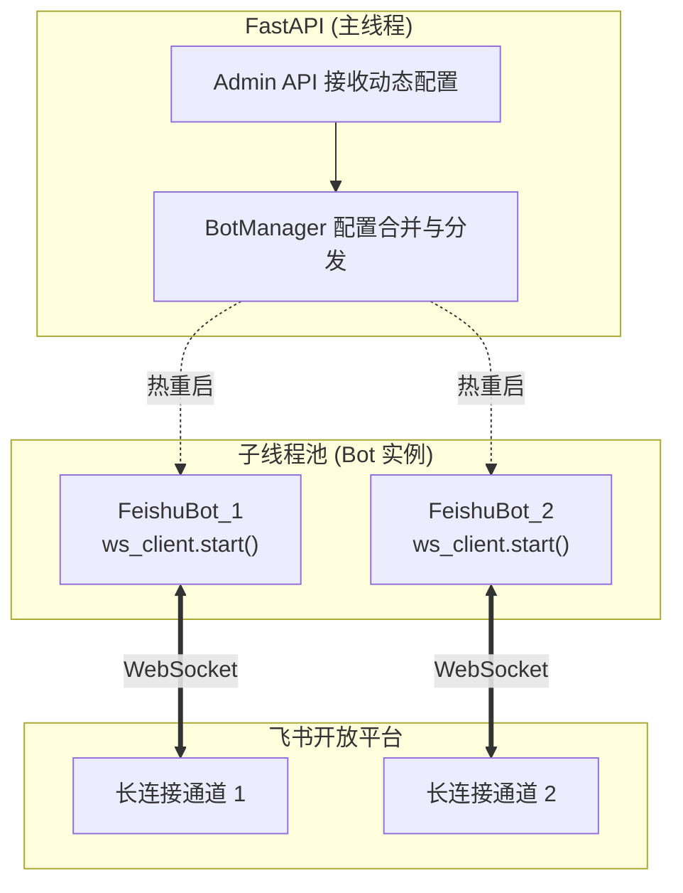
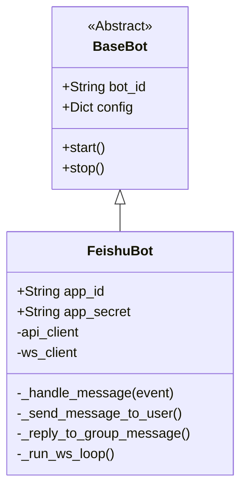

# 智能机器人系统消息侧（BOT服务器）一期建设规划方案

## 1. 项目概述与核心目标

### 1.1 建设背景
在智能机器人整体架构中，消息侧（BOT服务器）作为流量网关与协议转换层，直接对接各大IM客户端。一期建设采用**敏捷开发模式**，暂不接入高并发组件（RabbitMQ）与复杂业务大脑（Agent服务器），采用"原样返回（Echo）"的极简业务流。

为极大简化网络拓扑并提升安全性，一期优先采用**长连接（WebSocket）**模式对接飞书，无需公网 IP 和 Webhook 暴露，非常适合多线程多机器人实例的本地部署与动态管理。

### 1.2 一期核心目标
* **现代环境管理**：全面采用高性能包管理工具 `uv` 进行依赖及版本控制。
* **SDK 深度集成**：全面使用 `lark-oapi` 官方库管理 API 调用与 WebSocket 长连接，免除手动 Token 维护。
* **纯粹的管理网关**：`FastAPI` 仅用于提供 Admin 控制台 API 接口，不再承担面向外网的消息路由任务。
* **多实例与线程隔离**：实现单进程下多机器人协同，每个机器人在独立子线程中维护自己的长连接通道。
* **双模配置覆盖**：支持本地 `bot.json` 静态加载与 HTTP API 动态注入，强执行"API配置覆盖本地配置"策略，并支持长连接的热重启。

---

## 2. 技术选型

| 组件/模块 | 选型方案 | 说明 |
| :--- | :--- | :--- |
| **语言版本** | Python 3.11+ | 提供成熟的类型提示与出色的异步/多线程性能。 |
| **包/版本管理** | `uv` | 极速的依赖解析与虚拟环境管理，替代传统的 pip/poetry。 |
| **Web 框架** | FastAPI | 原生支持异步，仅暴露内部管理端口，用于热更新 Bot 凭证。 |
| **飞书核心库** | `lark-oapi>=1.4.8` | 官方原生支持长连接 (`lark.ws.Client`) 及事件分发机制。 |
| **并发模型** | `threading` | 各机器人实例占用独立子线程，阻塞式监听 WebSocket 事件。 |
| **数据校验** | Pydantic v2 | 强类型解析 `bot.json` 与 API 请求，实现深度合并与安全校验。 |
| **日志框架** | `loguru` | 线程安全的高性能日志库，支持上下文绑定与结构化输出。 |

### 2.1 并发模型设计考量

本项目核心网关采用 `FastAPI`（基于 `asyncio`）处理高并发的 Admin API 请求。然而，飞书官方提供的 Python SDK (`lark-oapi`) 其底层的 WebSocket 客户端实现是**完全同步阻塞**的。

若直接在 FastAPI 的协程中启动飞书 WS 客户端，将导致整个事件循环被阻塞，网关瘫痪。因此，系统采用 `threading.Thread` 为每个 Bot 实例分配独立的系统级线程。这种"**主线程异步 Web + 子线程同步长连接**"的混合架构，既规避了 SDK 的同步限制，又实现了 Bot 实例间的物理隔离。

---

## 3. 核心架构设计

### 3.1 多机器人独立监听模型 (Architecture)
彻底摒弃统一的 Webhook 流量入口。每个 Bot 实例内部拥有自己的 `API Client`（发消息）和 `WebSocket Client`（收消息）。



### 3.2 平台抽象层设计 (Platform Abstraction)

为二期扩展预留空间，定义抽象基类规范生命周期。



---

## 4. 目录结构规范

遵循 `uv` 推荐的现代 Python 项目规范：

```text
backend-gateway/
├── .venv/                  # uv 自动管理的虚拟环境
├── .env                    # 本地环境变量配置 (不提交)
├── .gitignore              # 忽略敏感信息与环境文件
├── config/
│   └── bot.template.json   # 配置文件模板 (不包含明文 Secret)
├── src/
│   ├── __init__.py
│   ├── main.py             # FastAPI 启动入口与 Admin API 路由
│   ├── manager.py          # BotManager 线程管理与配置覆盖核心逻辑
│   ├── core/               # 核心抽象层
│   │   ├── __init__.py
│   │   ├── base.py         # BaseBot 抽象基类
│   │   └── schemas.py      # Pydantic 数据模型定义
│   └── platforms/          # 具体平台实现层
│       ├── __init__.py
│       └── feishu/
│           ├── __init__.py
│           └── bot.py      # FeishuBot 类实现 (长连接与消息收发逻辑)
├── pyproject.toml          # uv 标准项目描述文件
├── uv.lock                 # 依赖锁文件
└── README.md
```

> **注意**：用户需从 `bot.template.json` 复制为 `config/bot.json` 并填入实际凭证。`bot.json` 和 `.env` 已加入 `.gitignore`，不会提交到仓库。

---

## 5. 配置管理与覆盖策略 (Override Policy)

配置源分为本地静态源与 API 动态源，以保障灵活性和持久化基础。

### 5.1 基础配置定义

* `APP_ID`: 飞书应用唯一标识。
* `APP_SECRET`: 飞书应用密钥。

### 5.2 冲突解决与热重启规则

1. **初始化**：启动时，`BotManager` 解析 `config/bot.json`，在各个子线程拉起对应的 WebSocket 监听。
2. **API 覆盖**：当调用管理 API (`POST /api/v1/admin/bots`) 传入新凭证时，执行深度合并。**强行以 API 传入的值为准**，覆盖本地配置。
3. **平滑重启**：发现配置变更后，`BotManager` 将断开对应实例的 WebSocket 长连接，安全结束该子线程，随后使用新合并的配置重新实例化并拉起新线程。

---

## 6. 飞书长连接对接规范

根据官方建议及 SDK 特性，代码实现需严格遵守以下规范：

1. **统一事件分发**：使用 `lark.EventDispatcherHandler` 注册 `im.message.receive_v1` 回调，替代手动解析请求体。
2. **免 Token 管理**：由 `lark.Client` 自动管理 `tenant_access_token` 的获取、缓存与刷新，业务层不直接触碰 Token。
3. **消息路由与格式**：
   * 提取事件中的 `chat_type` 判断为 `p2p` 或 `group`。
   * 单聊调用 `message.create`（指定 `open_id`），群聊调用 `message.reply`（指定 `message_id`）。
   * 所有返回给飞书的 `content` 字段**必须**通过 `lark.JSON.marshal({"text": "回复内容"})` 序列化为 JSON 字符串。
4. **真实 ID 约束**：绝不在代码中硬编码任何 `open_id` 或 `message_id`，全部从长连接推送的真实事件中动态解析，彻底规避 99992351 / 99992354 错误。

---

## 7. 长连接韧性与重连策略 (Resilience & Reconnection)

生产环境中网络抖动是常态，必须明确断线恢复机制：

1. **SDK 内置恢复机制**：依赖 `lark-oapi` 内部的心跳检测（Ping/Pong），应对常规的网络闪断。
2. **指数退避 (Exponential Backoff)**：若飞书服务端主动断开或鉴权失败，子线程捕获异常后，实施 `1s -> 2s -> 4s -> 8s` 的指数退避重连策略，防止请求雪崩。
3. **Watchdog 守护机制**：`BotManager` 在主线程中维护一个轻量级的定时轮询任务（Watchdog），周期性检查所有 Bot 子线程的 `is_alive()` 状态。若发现非预期退出的僵尸线程，主动回收资源并重新拉起。

---

## 8. 日志与可观测性 (Logging & Monitoring)

多线程环境下，日志串联和隔离是排查问题的唯一抓手：

1. **日志选型**：引入 `loguru` 替代标准 `logging` 库，确保多线程环境下的线程安全与异步写入性能。
2. **上下文隔离**：利用日志上下文绑定机制（Contextual Logger），在每个子线程启动时注入实例标签。所有输出日志必须强制携带 `[BotID: xxx]` 与 `[ThreadID: xxx]`，实现多机器人日志的物理隔离与快速检索。
3. **健康检查端点**：FastAPI 提供 `/api/v1/health` 接口，实时暴露当前内存中活跃的 Bot 线程数、运行时长及最新异常堆栈。

---

## 9. 安全与敏感信息保护 (Security)

必须从物理和逻辑层面封堵密钥泄露的风险：

1. **禁止硬编码**：任何 `APP_SECRET`、`Encrypt Key` 绝对不允许硬编码在代码中。
2. **配置隔离**：本地调试时，敏感凭证通过 `.env` 文件加载，且 `.env` 和 `config/bot.json` 必须被加入 `.gitignore`。代码仓库仅保留结构化的 `bot.template.json`。
3. **内存级流转**：通过 Admin API 下发的动态凭证仅在 `BotManager` 的内存结构中流转合并，一期不落盘，防止服务器被攻破后配置文件遭窃取。

---

## 10. 实施里程碑 (2周 Sprint)

* **阶段一 (Day 1-4)：基础设施与 SDK 融合**
  使用 `uv` 初始化工程，配置 `pyproject.toml`，引入 `lark-oapi`。编写 `BaseBot` 抽象与 `FeishuBot` 具体实现，打通单机、单实例的飞书长连接收发测试 (Echo 回复逻辑)。
* **阶段二 (Day 5-7)：多线程管理与保活验证**
  编写 `BotManager`，实现单进程内读取 `bot.json` 并同时拉起多个不同 `app_id` 的子线程。测试多机器人并发接收消息时的线程安全性与互不干扰特性。
* **阶段三 (Day 8-10)：API 配置管理与热重启联调**
  引入 FastAPI，实现 `/api/v1/admin/bots` 接口。联调测试"API 下发新凭证 -> 停止旧长连接 -> 销毁旧线程 -> 拉起新配置线程"的完整热更新链路。整理交付文档，并为二期接入 RabbitMQ 预留代码埋点。