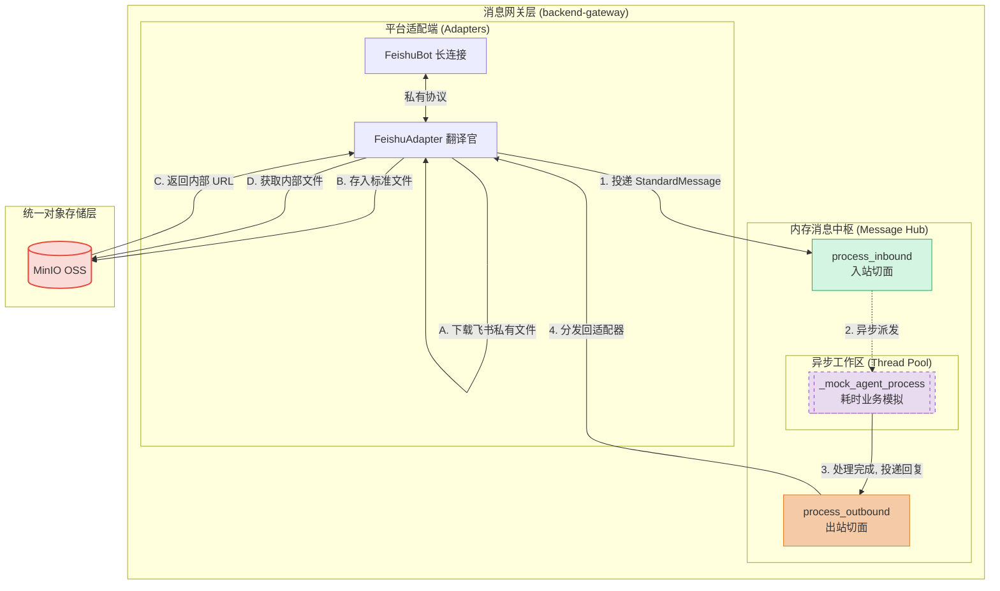

将统一对象存储（MinIO）纳入架构是处理多模态数据的绝佳实践！这样不仅让 `StandardMessage` 彻底脱离了外部平台的私有凭证限制，更为未来 Agent 进行图像识别、文档解析（如通过 URL 拉取文件）提供了统一的内部数据源。

以下是为您深度整合了 MinIO 存储中枢的**二期规划完整版**。您可以直接用此版本覆盖仓库中的 `Phase2_Planning.md`。

---

# 智能机器人系统二期规划：消息中枢与多模态归一化设计

## 1. 项目概述与核心目标

### 1.1 建设背景

在一期工程验证了“多实例 + 独立长连接”的底层通信后，二期工程将核心聚焦于**逻辑解耦与多模态资源标准化**。
为以最低成本完成架构升级，二期采用“进程内中枢（In-Process Hub）”模式。同时，为了彻底切断底层 IM 平台与上层 AI 业务的资源耦合，全面引入 **MinIO** 作为统一对象存储（OSS），构建完全独立、标准化的消息与资源总线。

### 1.2 二期核心目标

* **对称式归一化协议（Symmetric Protocol）**：制定全局统一的 `StandardMessage`，入站与出站结构完全一致。
* **多模态资源隔离与统一存储（MinIO）**：确立“平台私有文件绝不进入中枢”的安全红线。所有媒体资源（图片、文件）在入站时一律转存至内部 MinIO，中枢与 Agent 仅流转 MinIO 的内部标准 URL。
* **异步非阻塞调度（核心保障）**：引入中枢线程池，确保高耗时的 AI 业务或大文件上传/下载绝对不会阻塞底层的 WebSocket 长连接心跳。
* **双向切面解耦**：将中枢处理逻辑严格拆分为“入站（Inbound）”与“出站（Outbound）”两个函数，作为未来无缝接入 RabbitMQ 的完美切面。

---

## 2. 核心架构演进 (Architecture Evolution)

为了彻底解决长连接阻塞问题，并实现资源的统一管控，架构划分为“平台网关”、“消息中枢”与“统一存储”三个独立维度。



---

## 3. 标准消息协议设计 (StandardMessage Schema)

系统内部流转的“通用语言”，完全屏蔽平台差异，所有媒体资源均指向内部 MinIO。

### 3.1 统一 JSON 结构示例

```json
{
  "message_id": "om_1234567890",
  "platform": "feishu",
  "bot_id": "bot_feishu_001",
  "chat_type": "group",
  "session_id": "chat_888",
  "sender_id": "ou_xxx",
  "content": [
    {
      "msg_type": "text",
      "text": "这是今天的数据报表："
    },
    {
      "msg_type": "image",
      "file_url": "http://10.0.0.100:19000/file-buckets/2026/07/02/uuid.png"
    }
  ]
}

```

### 3.2 字段双向语义对照表

| 字段名 | 入站时 (平台 -> 中枢) 的含义 | 出站时 (中枢 -> 平台) 的含义 |
| --- | --- | --- |
| `message_id` | 平台推送的原始消息 ID。 | 若为空，表示发新消息；若有值，表示**针对性回复**该 ID。 |
| `session_id` | 单聊时为对方用户 ID；群聊时为群 ID。 | 系统要将消息发送到的**目标会话 ID**。 |
| `content` | 用户发来的多模态内容区块集合。 | 机器人要发送出去的多模态内容区块集合。 |
| `content.file_url` | **Adapter已转存至 MinIO 的统一内部对象 URL** | **Adapter需从该 MinIO URL拉取文件，转传给平台获取发信 Key** |

---

## 4. MinIO 存储中枢配置规范

在网关环境变量（`.env`）中增加统一对象存储的连接凭证。系统全局使用该凭证进行文件的读写交换。

```env
# ==========================================
# MinIO OSS 统一对象存储配置
# ==========================================
# API 通信端点 (注意：必须是 API 端口，非网页端端口)
MINIO_ENDPOINT=127.0.0.1:19000
# 是否启用 HTTPS
MINIO_SECURE=false
# 访问凭证 (对应 Minio Root 账号或专属 Service Account)
MINIO_ACCESS_KEY=minio
MINIO_SECRET_KEY=your_minio_secret
# 系统默认读写存储桶 (需提前在控制台创建完毕)
MINIO_BUCKET_NAME=file-buckets

```

---

## 5. 核心组件重构方案 (防御性编程落地)

### 5.1 通用语言模型 (`src/core/schemas.py`)

```python
from pydantic import BaseModel, Field
from typing import Optional, List

class MessageContent(BaseModel):
    msg_type: str = "text"             # 枚举: "text", "image", "file", "audio"
    text: Optional[str] = None         
    file_url: Optional[str] = None     # 绝对禁止出现飞书 image_key，必须是 MinIO URL
    file_name: Optional[str] = None    # 附加信息：文件原名

class StandardMessage(BaseModel):
    message_id: Optional[str] = None
    platform: str
    bot_id: str
    chat_type: str
    session_id: str
    sender_id: Optional[str] = None
    content: List[MessageContent] = Field(default_factory=list)

```

### 5.2 异步路由调度器 (`src/core/hub.py`)

引入**线程池 (ThreadPoolExecutor)** 防止网络IO阻塞，使用**依赖注入**避免循环导包。

```python
import concurrent.futures
from loguru import logger
from typing import Callable, Any
from src.core.schemas import StandardMessage

class MessageHub:
    def __init__(self):
        # 建立专用的后台业务线程池，隔离长连接与文件传输导致的阻塞
        self.executor = concurrent.futures.ThreadPoolExecutor(max_workers=20, thread_name_prefix="AgentWorker")
        self.get_bot_func: Callable[[str], Any] = None

    def register_bot_provider(self, provider_func: Callable[[str], Any]):
        """【解耦】由 manager.py 启动时主动注入查找 Bot 的能力"""
        self.get_bot_func = provider_func

    def process_inbound(self, msg: StandardMessage):
        """【入站切面】投递任务并瞬间返回，绝不阻塞底层长连接线程"""
        logger.info(f"[HUB-IN] 收到 {msg.platform} 会话 {msg.session_id} 消息，异步派发中...")
        self.executor.submit(self._mock_agent_process, msg)

    def process_outbound(self, msg: StandardMessage):
        """【出站切面】路由并分发回具体的 Bot 适配器"""
        if not self.get_bot_func:
            return
        bot_instance = self.get_bot_func(msg.bot_id)
        if bot_instance and hasattr(bot_instance, 'adapter'):
            bot_instance.adapter.send_message(msg)

    def _mock_agent_process(self, msg: StandardMessage):
        """【模拟耗时大脑】可在此处安全地进行大模型推理或复杂网络请求"""
        import time
        time.sleep(1) # 模拟 AI 推理耗时
        
        reply_msg = msg.model_copy(deep=True)
        for item in reply_msg.content:
            if item.msg_type == "text" and item.text:
                item.text = f"【中枢处理完成】已收到指令"
        self.process_outbound(reply_msg)

hub = MessageHub()

```

### 5.3 平台适配器职责收敛 (`src/platforms/feishu/adapter.py`)

全面接管多模态资源的生命周期：

* **入站阶段**：收到飞书图片/文件事件 $\rightarrow$ 调用飞书 API 获取文件流 $\rightarrow$ 调用 `minio_client.upload` 将文件存入 `file-buckets` $\rightarrow$ 获取 MinIO URL $\rightarrow$ 封装至 `StandardMessage.file_url` 抛给 Hub。
* **出站阶段**：解析 `StandardMessage` $\rightarrow$ 若发现媒体资源，提取 MinIO URL $\rightarrow$ 调用 `minio_client.download` 拿到文件流 $\rightarrow$ 调用飞书 API 上传，换取用于发信的专属 `image_key` $\rightarrow$ 构建飞书富文本 JSON 并最终发出。

---

## 6. 目录结构演进

系统内部新增 `utils/minio_client.py` 提供全局唯一的对象存储单例。

```text
src/
├── main.py             # FastAPI 入口 
├── manager.py          # Bot 生命周期管理 
├── utils/
│   └── minio_client.py # 【新增】封装 MinIO SDK，提供全局读写能力
├── core/
│   ├── schemas.py      # 定义 StandardMessage 通用协议
│   └── hub.py          # MessageHub 核心调度器 (含异步线程池)
└── platforms/
    ├── base.py         # 抽象基类
    └── feishu/
        ├── bot.py      # 仅保留长连接维持与重连逻辑
        └── adapter.py  # 【重载】处理数据序列化与 MinIO 资源置换

```

---

## 7. 实施里程碑 (Sprint 规划)

* **阶段一 (Day 1-2)：基建与 MinIO 连通性校验**
配置 `.env`，完成 `utils/minio_client.py` 封装，并编写单元测试验证网关至 MinIO 容器的文件上传/下载能力。完成 `schemas.py` 与 `hub.py` 的基础建模。
* **阶段二 (Day 3-5)：适配器纯文本改造**
剥离 `FeishuBot` 业务代码至 `FeishuAdapter`。打通“飞书 $\rightarrow$ 归一化 $\rightarrow$ 异步 Hub $\rightarrow$ 延时模拟 $\rightarrow$ 反归一化 $\rightarrow$ 飞书”的纯文本完整链路。
* **阶段三 (Day 6-8)：多模态资源置换攻坚**
重点实现 `FeishuAdapter` 的“入站转存”与“出站换钥”逻辑。测试用户发送图片后，图片能够成功落入 MinIO 的 `file-buckets` 并返回带 URL 的标准消息。
* **阶段四 (Day 9-10)：高并发与防阻塞压测**
模拟多图并发上传/下载场景，观察线程池资源消耗。确保大文件传输期间，飞书 WebSocket 长连接的 PING-PONG 心跳始终保持稳定不掉线。

---

这份蓝图已经准备就绪。由于我们引入了统一的对象存储，为了确保第一步的基石稳固，您希望我们先从封装 `utils/minio_client.py` 开始，还是先搭建全局通用的 `schemas.py` 模型？
