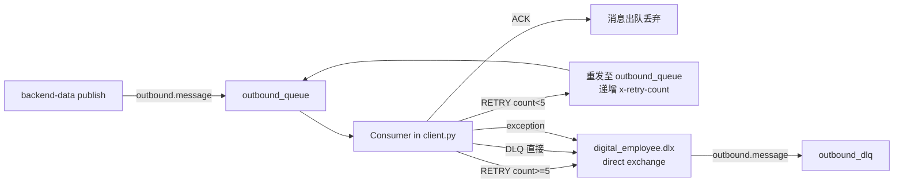
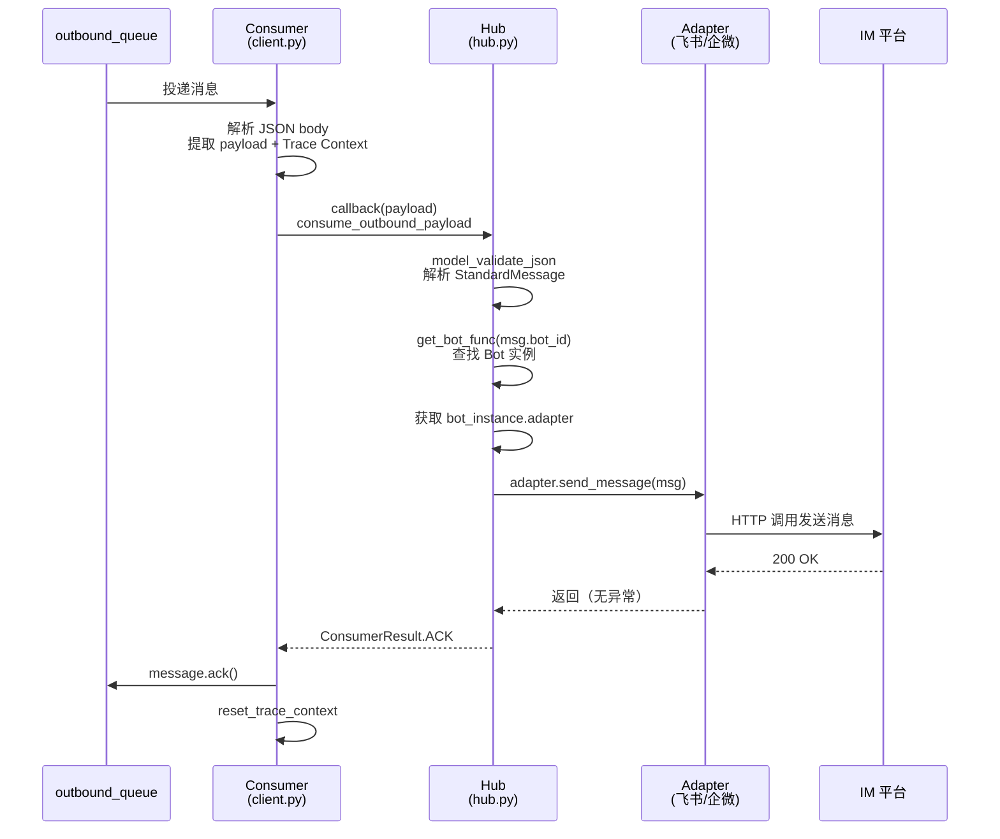

# Gateway 出站消息重试与 DLQ 逻辑

## 概述

Gateway 通过 `backend-share/rabbitmq-client` 直连 RabbitMQ 消费 `outbound_queue`，
将消息发送到 IM 平台（飞书/企微）。消费流程采用 **手动 ACK + 三态路由 + DLQ 兜底**
机制，避免无限重试导致消息积压，同时区分「可重试失败」与「不可重试失败」。

## 架构总览



## 消费流程

### 入口

`backend-share/rabbitmq-client/src/rabbitmq_client/client.py` 的 `start_outbound_consumer`

1. 通过 `outbound_queue.iterator()` 拉取消息
2. 解析 JSON body，提取 `payload` 与 Trace Context（`trace_id` / `parent_span_id`）
3. 调用回调函数 `callback(payload)`，返回 `ConsumerResult`
4. 根据 `ConsumerResult` 路由消息（见下文）
5. 异常时视为不可重试失败，转 DLQ

### 关键设计：移除 `message.process()` 上下文管理器

原实现使用 `async with message.process(requeue=True, ignore_processed=True):`，
该上下文管理器在正常退出时自动 ACK、异常退出时自动 `nack(requeue=True)`，
无法表达三态（ACK/RETRY/DLQ），且与内部手动 ACK 重复触发 `ignore_processed` 抑制。

现改为 **纯手动 ACK/NACK**，控制流集中在一处。

## 成功路径

消息从消费到发送成功的完整流程：



### 关键步骤

1. **消息投递**：RabbitMQ 将 `outbound_queue` 中的消息投递给消费者
2. **解析与 Trace 绑定**：SDK 解析 JSON body，提取 `payload` 字段；
   若包含 `trace_id` 与 `parent_span_id`，绑定 Trace Context 用于链路追踪
3. **回调入口**：SDK 调用 `hub.consume_outbound_payload(payload_json)`
4. **消息反序列化**：`StandardMessage.model_validate_json` 将 JSON 解析为标准消息对象
5. **查找 Bot 实例**：通过 `get_bot_func(msg.bot_id)` 在本地 Bot 注册表中查找
6. **获取 Adapter**：从 `bot_instance.adapter` 获取对应平台的适配器
7. **发送消息**：在 `trace_operation` 上下文中调用 `adapter.send_message(msg)`，
   记录 `EXTERNAL_API` 类型的 Trace 事件
8. **返回 ACK**：发送成功（无异常抛出），`process_outbound` 返回 `ConsumerResult.ACK`
9. **确认消息**：SDK 调用 `message.ack()`，消息从队列永久出队
10. **清理 Trace**：`reset_trace_context` 还原原始 Trace 上下文

### Trace 埋点

成功路径在两个 `trace_operation` 上下文中执行：

| 上下文 | service | kind | operation | event_type |
|--------|---------|------|-----------|------------|
| 消费层 | `BACKEND_GATEWAY` | `CONSUMER` | 消费 MQ 出站消息 | `MQ_CONSUME` |
| 发送层 | `BACKEND_GATEWAY` | `CLIENT` | 发送 IM 消息 | `EXTERNAL_API` |

发送层额外记录 `attributes={"platform": ..., "bot_id": ...}`，便于按平台与
Bot 维度筛选 Trace。

## ConsumerResult 三态

`backend-share/rabbitmq-client/src/rabbitmq_client/client.py` 定义：

```python
class ConsumerResult(enum.Enum):
    ACK = "ack"      # 处理成功，SDK 直接 ACK
    RETRY = "retry"  # 可重试失败，SDK 递增 retry_count 后重发
    DLQ = "dlq"      # 不可重试失败，SDK 直接转 DLQ
```

### 路由策略（`_route_message` 方法）

| 回调返回 | retry_count | 动作 |
|----------|-------------|------|
| `ACK`    | -           | `message.ack()`，消息出队 |
| `RETRY`  | < 5         | 重发消息至原队列（递增 `x-retry-count` header），`ack` 原消息 |
| `RETRY`  | >= 5        | 转发至 DLQ，`ack` 原消息 |
| `DLQ`    | -           | 转发至 DLQ，`ack` 原消息 |
| 异常     | -           | 转发至 DLQ（附加 `x-dead-letter-reason`），`ack` 原消息 |

### 异常兜底

回调抛异常时，SDK 在 `_route_message` 外层捕获，尝试转 DLQ；
若 DLQ 转投也失败，最后兜底 `nack(requeue=False)` 丢弃消息，避免阻塞队列。

## 失败语义区分

`backend-gateway/src/core/hub.py` 的 `process_outbound` 负责区分失败类型：

| 失败场景 | 返回值 | 原因 |
|----------|--------|------|
| 消息格式校验失败（`ValidationError`） | `DLQ` | 重试无意义，消息本身有问题 |
| `get_bot_func` 未注册 | `DLQ` | 配置缺失，重试无意义 |
| Bot 实例不存在 | `DLQ` | 配置缺失，重试无意义 |
| Adapter 缺失 | `DLQ` | 配置缺失，重试无意义 |
| IM 平台发送失败（网络/限流/鉴权） | `RETRY` | 可能瞬时故障，重试有意义 |
| 发送成功 | `ACK` | 正常完成 |

## 重试机制

### 重试计数

通过消息 header `x-retry-count` 跟踪重试次数。

- 首次投递：header 不存在，计为 0
- 每次重试：SDK 读取当前 `x-retry-count`，递增后写入新消息 header，重发至原队列
- 超过上限（默认 5）：转 DLQ

### 重试方式：重发 + ACK 原消息

采用「重发新消息 + ACK 原消息」而非 `nack(requeue=True)`：
- `nack(requeue=True)` 无法修改 header，无法跟踪重试次数
- 重发新消息可以递增 `x-retry-count`，精确控制重试上限

### 重试上限

```python
MAX_RETRY_COUNT = 5
```

5 次重试可覆盖大多数 IM 平台瞬时故障（网络抖动通常几秒到几分钟恢复）。

## DLQ 拓扑

### 声明（`ensure_topology` 方法）

| 资源 | 名称 | 类型 | 说明 |
|------|------|------|------|
| DLX | `digital_employee.dlx` | direct | 死信交换机 |
| DLQ | `outbound_dlq` | queue (durable) | 死信队列 |
| 绑定 | DLQ → DLX | routing_key = `outbound.message` | 与原队列 routing_key 一致 |

### 死信消息元信息

转投 DLQ 时保留原消息 body 与 headers，附加：

- `x-dead-letter-reason`：死信原因（如 `callback_marked_dlq`、`retry_exhausted:5`、`consumer_exception:ValueError`）
- `x-retry-count`：原消息的重试次数（便于排查）

### 手动控制 vs 队列级自动转投

本方案采用 **手动控制** DLQ 路由（SDK 主动 publish 到 DLX），不依赖队列参数
`x-dead-letter-exchange` 自动转投。原因：

- 控制流集中在一处，便于在死信消息中附加原因元信息
- 不依赖队列参数，迁移更灵活
- 可区分「应该 DLQ」与「应该 ACK」

## 关键代码位置

| 文件 | 说明 |
|------|------|
| `backend-share/rabbitmq-client/src/rabbitmq_client/client.py` | `ConsumerResult` enum、`start_outbound_consumer`、`_route_message`、`_publish_to_dlq`、`_republish_for_retry` |
| `backend-gateway/src/core/hub.py` | `consume_outbound_payload`、`process_outbound`（失败语义区分） |
| `backend-gateway/src/utils/data_access.py` | `start_consumer`（callback 类型注解） |

## 遗留风险与后续优化

### 1. 重试无延迟

当前重试为立即重发（ACK 原消息 + publish 新消息），短时间内密集失败可能压垮
IM 平台。后续可通过 **TTL + 延迟队列** 实现：

- 声明 `outbound_retry_delay` 队列，设置 `x-message-ttl`（如 30s）
- 重试消息先发到延迟队列，TTL 到期后通过 `x-dead-letter-exchange` 转回原队列

### 2. DLQ 消费与告警

当前仅落库 DLQ 基础设施，未实现 DLQ 消费端。后续需：

- 提供 DLQ 查询 API（列出死信消息、原因、时间）
- 接入告警（DLQ 消息数超阈值时通知）

### 3. 重试上限可配置化

当前 `MAX_RETRY_COUNT = 5` 为硬编码，后续可提取到配置项（`settings.py` 或
环境变量），便于不同环境调整。
