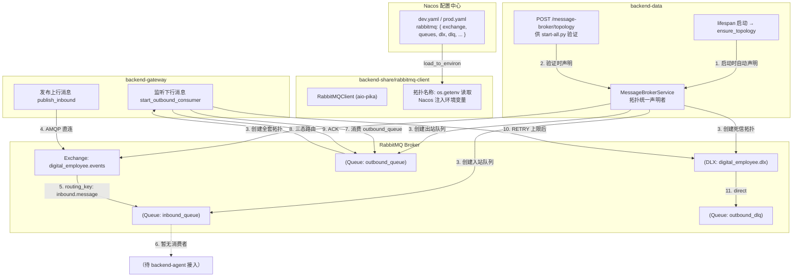

# RabbitMQ 消息收发架构与代码示例指南

## 1. 概述与架构定位

在数字员工系统中，消息收发已全面重构升级为**原生 AMQP 协议直连**模式。通过共享模块 `backend-share/rabbitmq-client`（基于高性能 Python 异步驱动 `aio-pika` 封装），网关 (`backend-gateway`) 可以直接与 RabbitMQ 建立高性能异步连接，去除了原先中间 HTTP REST 代理层的延迟与吞吐瓶颈。

### 模块使用矩阵

| 模块 | 依赖方式 | 使用角色 | 当前状态 |
| :--- | :--- | :--- | :--- |
| `backend-share/rabbitmq-client` | `aio-pika>=9.4.0` | 共享客户端 SDK | **活跃** — 提供 `RabbitMQClient` 单例、三态路由（ACK/RETRY/DLQ）。拓扑名称从 `os.getenv` 读取（Nacos 注入），幂等 declare 获取本地引用 |
| `backend-gateway` | path-based 依赖 `rabbitmq-client` | 上行发布者 + 下行消费者 | **活跃** — 通过 `GatewayMessageBusClient` 封装，publish_inbound 上行消息 + start_outbound_consumer 消费下行消息 |
| `backend-data` | 直连 `aio-pika==9.6.2`（非 share 包） | **拓扑统一声明者** | **活跃** — 在 lifespan 启动时自动调用 `ensure_topology()` 声明 `digital_employee.events` 全套拓扑（含 DLX/DLQ），同时保留 `POST /message-broker/topology` 端点供启动验证 |
| `backend-agent` | 未引入 | 无 | **未接入** — 当前无 RabbitMQ 依赖，inbound_queue 消息暂无人消费；outbound_queue 消息由 backend-gateway 的 Test 模式（内存 Mock）模拟回复 |

### 当前消息流拓扑



### 关键说明

1. **`backend-data` 是 RabbitMQ 拓扑的统一声明者**：在 lifespan 启动时自动调用 `ensure_topology()` 创建 `digital_employee.events` 全套拓扑（Exchange、inbound_queue、outbound_queue、DLX、DLQ），同时保留 `POST /message-broker/topology` 端点供 `start-all.py` 启动验证。
2. **`backend-gateway` 是当前唯一活跃的 AMQP 收发参与者**：同时扮演上行消息发布者（`publish_inbound`）和下行消息消费者（`start_outbound_consumer`）。拓扑名称通过 `backend-share/rabbitmq-client` 的 `os.getenv` 从 Nacos 注入的环境变量读取，幂等 declare 获取本地引用，不自主声明拓扑。
3. **`inbound_queue` 尚无消费者**：`backend-agent` 尚未接入 RabbitMQ，网关发布的上行消息目前积压在队列中。Bot 在 Test 模式下通过内存 Mock 模拟回复，不依赖 MQ。
4. **拓扑名称通过 Nacos 统一配置**：`dev.yaml`/`prod.yaml` 中 `rabbitmq` 嵌套段定义全套拓扑名称，经 `NacosClient.load_to_environ()` 拍平后注入环境变量，`backend-data` 的 `Settings` 和 `share` 包的 `RabbitMQClient` 均从此读取。
5. **DLQ 死信拓扑由 `backend-data` 一并声明**：`digital_employee.dlx`（direct）+ `outbound_dlq`，支持三态消费路由（ACK/RETRY/DLQ）。

---

## 2. AMQP 拓扑与路由规则

| 元素类型 | 名称 | 类型 / 属性 | 说明 |
| :--- | :--- | :--- | :--- |
| **Exchange** | `digital_employee.events` | `Topic` (Durable) | 系统全局事件交换机（由 backend-data 统一声明） |
| **Inbound Queue** | `inbound_queue` | Durable | 上行（终端 -> 系统）入站消息队列，Routing Key: `inbound.message` |
| **Outbound Queue** | `outbound_queue` | Durable | 下行（系统 -> 终端）出站消息队列，Routing Key: `outbound.message` |
| **DLX** | `digital_employee.dlx` | `Direct` (Durable) | 死信交换机，接收超限重试的消息 |
| **DLQ** | `outbound_dlq` | Durable | 死信队列，绑定 DLX，Routing Key: `outbound.message` |

---

## 3. 配置加载与 Nacos 配置中心管理

系统统一采用 **Nacos 配置中心** 管理服务与连接凭证。在微服务启动阶段通过 `nacos-client`（调用 `NacosClient.from_env_optional().load_to_environ()`）从 Nacos 动态拉取最新的配置，并自动注入到环境变量供 `rabbitmq-client` 实时感知的。

### Nacos 配置项示例 (Data ID: `dev.yaml` / `prod.yaml`)

```yaml
rabbitmq:
  # RabbitMQ 服务地址
  host: 127.0.0.1
  # AMQP 协议端口
  amqp_port: 5672
  # 管理后台端口
  http_port: 15672
  # 连接用户名
  username: guest
  # 连接密码
  password: guest
  # Topic 交换机名称（backend-data 统一声明，share 包幂等获取引用）
  exchange: digital_employee.events
  # 上行（终端 -> 系统）入站消息队列
  inbound_queue: inbound_queue
  # 下行（系统 -> 终端）出站消息队列
  outbound_queue: outbound_queue
  # 入站消息路由键
  inbound_routing_key: inbound.message
  # 出站消息路由键
  outbound_routing_key: outbound.message
  # 死信交换机名称（Direct 类型）
  dlx: digital_employee.dlx
  # 死信队列名称
  dlq: outbound_dlq
  # 消费者预取计数
  prefetch_count: 20
```

> 上述配置经 `NacosClient.load_to_environ()` 拍平后注入环境变量（`RABBITMQ_HOST`、`RABBITMQ_EXCHANGE`、`RABBITMQ_INBOUND_QUEUE` 等），`backend-data` 的 `Settings` 和 `share` 包的 `RabbitMQClient` 均从此读取。

### 服务启动并自动注入 Nacos 配置流程

```python
import os
from nacos_client import NacosClient
from rabbitmq_client import get_rabbitmq_client

# 1. 优先从 Nacos 配置中心动态拉取最新配置并写入 os.environ
nacos_client = NacosClient.from_env_optional()
if nacos_client is not None:
    nacos_client.load_to_environ()

# 2. 初始化 RabbitMQ 客户端（将自动使用 Nacos 注入的 RABBITMQ_URL 环境变量）
mq_client = get_rabbitmq_client()
```

---

## 4. 核心收发代码示例

### 示例 1：网关上行消息发布 (Publish Inbound Message)
网关接收到飞书/企微的 Webhook IM 消息后，归一化消息并直接写入 `inbound_queue`：

```python
import asyncio
from rabbitmq_client import get_rabbitmq_client

async def handle_feishu_webhook(bot_id: str, raw_payload: str):
    # 1. 获取全局共享的 RabbitMQ 客户端
    mq_client = get_rabbitmq_client()
    
    # 2. 建立/确认拓扑结构
    await mq_client.ensure_topology()
    
    # 3. 将上行消息发布入队列（自动绑定当前分布式 TraceContext 链路追踪）
    result = await mq_client.publish_inbound(
        platform="feishu",
        bot_id=bot_id,
        payload=raw_payload,
    )
    print(f"上行消息发布成功: {result}")

# 运行示例
# asyncio.run(handle_feishu_webhook("bot_123", '{"text": "你好"}'))
```

---

### 示例 2：预留 — 后端 Agent 监听上行消息 (Consume Inbound Message)

> **当前状态**：`backend-agent` 尚未接入 RabbitMQ，`inbound_queue` 暂无消费者。
> 以下代码为**预留模式**，待 `backend-agent` 接入 RabbitMQ 后使用。
> 当前 Test 模式 Bot 通过 `MessageHub._mock_agent_process()` 内存模拟回复，不依赖 MQ。

```python
import asyncio
from rabbitmq_client import get_rabbitmq_client, ConsumerResult

async def process_inbound_message(payload: str) -> ConsumerResult:
    """上行消息处理回调逻辑。

    Returns:
        ConsumerResult: 返回 ACK 确认处理成功；返回 DLQ 表示不可重试失败；
                        返回 RETRY 表示可重试失败。
    """
    try:
        print(f"[Agent] 收到用户上行消息: {payload}")
        # 执行业务逻辑/LLM 推理...
        return ConsumerResult.ACK
    except Exception as exc:
        print(f"[Agent] 处理失败: {exc}")
        return ConsumerResult.DLQ  # 避免无限重试

async def main():
    mq_client = get_rabbitmq_client()
    await mq_client.ensure_topology()

    print("[Agent] 启动入站消息监听中...")
    # 使用 aio-pika 的异步迭代器持续监听 inbound_queue
    assert mq_client._inbound_queue is not None
    async with mq_client._inbound_queue.iterator() as queue_iter:
        async for message in queue_iter:
            raw_body = message.body.decode("utf-8")
            result = await process_inbound_message(raw_body)
            # 复用三态路由逻辑：ACK / RETRY / DLQ
            await mq_client._route_message(message, result, reason="inbound_consumer")

if __name__ == "__main__":
    # asyncio.run(main())
    pass
```

---

### 示例 3：预留 — 后端 Agent 发布下行回复消息 (Publish Outbound Message)

> **当前状态**：`backend-agent` 尚未接入 RabbitMQ，`outbound_queue` 消息由 `backend-gateway` 的 Test 模式（`_mock_agent_process`）写入。
> 以下代码为**预留模式**，待 `backend-agent` 接入 RabbitMQ 后使用。

```python
import asyncio
import json
import aio_pika
from rabbitmq_client import get_rabbitmq_client

async def publish_outbound_reply(bot_id: str, platform: str, reply_text: str):
    mq_client = get_rabbitmq_client()
    await mq_client.ensure_topology()
    
    assert mq_client._exchange is not None
    
    # 构造标准下行回复 Payload
    outbound_payload = {
        "bot_id": bot_id,
        "platform": platform,
        "content": reply_text,
    }
    
    amqp_message = aio_pika.Message(
        body=json.dumps(outbound_payload, ensure_ascii=False).encode("utf-8"),
        delivery_mode=aio_pika.DeliveryMode.PERSISTENT,
        content_type="application/json",
    )
    
    # 直接发布到 Topic Exchange，路由键为 outbound.message
    await mq_client._exchange.publish(amqp_message, routing_key=mq_client.outbound_routing_key)
    print(f"[Agent] 下行回复已成功写入 outbound_queue")

# 运行示例
# asyncio.run(publish_outbound_reply("bot_123", "feishu", "这是机器人的自动回复"))
```

---

### 示例 4：网关消费下行消息推送到开放平台 (Consume Outbound Message)
网关异步监听出站队列，将消息推送到飞书/企微开放平台 API，并根据推送结果返回 ACK/RETRY/DLQ 三态：

```python
import asyncio
from rabbitmq_client import get_rabbitmq_client, ConsumerResult

async def send_to_open_platform(payload: str) -> ConsumerResult:
    """网关推送给第三方开放平台的真正发信回调。

    Returns:
        ConsumerResult: 返回 ACK 推送成功；返回 RETRY 表示瞬时故障可重试；
                        返回 DLQ 表示不可重试失败（如消息格式错误、Bot 缺失）。
    """
    print(f"[Gateway] 收到下行消息，准备推送到第三方开放平台: {payload}")
    # 调用飞书/企微 SDK 发送 HTTP 消息...
    push_success = True
    return ConsumerResult.ACK if push_success else ConsumerResult.RETRY

async def start_gateway_outbound_listener():
    mq_client = get_rabbitmq_client()
    
    # 启动异步 AMQP 监听消费者（SDK 内部自动处理异常捕获、TraceContext 还原与 ACK/NACK）
    await mq_client.start_outbound_consumer(send_to_open_platform)

if __name__ == "__main__":
    # asyncio.run(start_gateway_outbound_listener())
    pass
```

---

## 5. backend-gateway 收发消息 JSON 现场报文示例 (StandardMessage)

网关与后端微服务之间统一采用归一化的 `StandardMessage` 消息协议模型进行交互：

### A. backend-gateway 发送的消息 (上行入站消息 / Inbound)

网关收到飞书/企微 Webhook 后归一化，写入 `inbound_queue` 发给后端 Agent：

#### 例子 1：单聊文本消息上行
```json
{
  "message_id": "om_5a8799a4c3e8784d12345678",
  "platform": "feishu",
  "bot_id": "bot_hr_assistant_01",
  "chat_type": "p2p",
  "session_id": "ou_382947192837192",
  "sender_id": "ou_382947192837192",
  "content": [
    {
      "msg_type": "text",
      "text": "帮我查一下这个月的年假剩余天数"
    }
  ]
}
```

#### 例子 2：群聊多模态（文本 + 图片附件）上行
```json
{
  "message_id": "om_7c992019ab123456",
  "platform": "wechat",
  "bot_id": "bot_finance_01",
  "chat_type": "group",
  "session_id": "oc_group_88392019",
  "sender_id": "user_102",
  "content": [
    {
      "msg_type": "text",
      "text": "请审批这张发票报销"
    },
    {
      "msg_type": "image",
      "file_url": "http://127.0.0.1:8010/api/v1/storage/raw/invoice_2026.png",
      "file_name": "invoice_2026.png"
    }
  ]
}
```

---

### B. backend-gateway 接收的消息 (下行出站消息 / Outbound)

当前下行消息由 `backend-gateway` 的 Test 模式（`MessageHub._mock_agent_process`）写入 `outbound_queue` 后，由同进程的出站消费者回调消费并推送平台。
待 `backend-agent` 接入 RabbitMQ 后，将由 Agent 大模型生成回复并写入 `outbound_queue`。

#### 例子 1：Agent 文本回复下行
```json
{
  "message_id": "om_5a8799a4c3e8784d12345678",
  "platform": "feishu",
  "bot_id": "bot_hr_assistant_01",
  "chat_type": "p2p",
  "session_id": "ou_382947192837192",
  "sender_id": "bot_hr_assistant_01",
  "content": [
    {
      "msg_type": "text",
      "text": "您好！查询到您本年度尚有 5 天带薪年假未休。如有请假需求，可在 HR 门户提交申请。"
    }
  ]
}
```

#### 例子 2：Agent 交互卡片回复下行
```json
{
  "message_id": "om_992817204918234",
  "platform": "feishu",
  "bot_id": "bot_it_support_01",
  "chat_type": "p2p",
  "session_id": "ou_7712391023910",
  "sender_id": "bot_it_support_01",
  "content": [
    {
      "msg_type": "card",
      "card_data": {
        "title": "IT 运维工单提交成功",
        "description": "已成功为您创建故障报修工单 #20260801",
        "status": "processing",
        "actions": [
          { "label": "查看工单进度", "value": "check_status" }
        ]
      }
    }
  ]
}
```

---

## 6. 分布式链路追踪 (TraceContext) 集成规范

`backend-share/rabbitmq-client` 已内置自动关联 `observability` 的链路追踪能力：

1. **发布时自动注入**：`publish_inbound` 会自动提取当前线程/协程的 `TraceContext`，并将 `X-Trace-Id` 与 `X-Span-Id` 写入 AMQP 消息 Header 和 Payload。
2. **消费时自动还原**：`start_outbound_consumer` 收到消息后，会自动从 Header 中解析 `TraceContext` 并绑定到当前消费协程上下文，确保应用全链路日志可追踪查询。

---

## 7. 部署迁移指南：拓扑名称变更

### 变更内容

本次重构将 RabbitMQ 拓扑名称全部更换，旧拓扑变为孤儿资源：

| 元素 | 旧名称 | 新名称 |
| :--- | :--- | :--- |
| Exchange | `bot.topic.exchange` | `digital_employee.events` |
| Inbound Queue | `q_inbound_to_agent` | `inbound_queue` |
| Outbound Queue | `q_outbound_to_gateway` | `outbound_queue` |
| Inbound Routing Key | `msg.inbound.#` | `inbound.message` |
| Outbound Routing Key | `msg.outbound.#` | `outbound.message` |
| DLX | —（新增） | `digital_employee.dlx` |
| DLQ | —（新增） | `outbound_dlq` |

### 迁移步骤

1. **部署新代码前**，检查旧队列中是否有未消费的消息：
   ```bash
   # 通过 RabbitMQ Management UI 或 rabbitmqctl 查看
   rabbitmqctl list_queues name messages
   # 重点关注 q_inbound_to_agent 和 q_outbound_to_gateway
   ```

2. **如有积压消息**，先手动消费或转存，再部署新代码。

3. **部署新代码后**，确认新拓扑已创建：
   ```bash
   curl http://127.0.0.1:8010/api/v1/health/ready
   ```
   响应中应包含 `exchange: digital_employee.events`、`dlx: digital_employee.dlx` 等新拓扑信息。

4. **确认正常运行后**，清理旧拓扑：
   ```bash
   rabbitmqctl delete_queue q_inbound_to_agent
   rabbitmqctl delete_queue q_outbound_to_gateway
   rabbitmqctl delete_exchange bot.topic.exchange
   ```

### 注意事项

- 旧队列中的消息**不会自动迁移**到新队列，需在部署前手动处理。
- `inbound_queue` 尚无消费者，积压不影响功能。
- `outbound_queue` 旧消息若未处理完，部署新代码后 gateway 只消费新队列，旧消息需手动处理。
