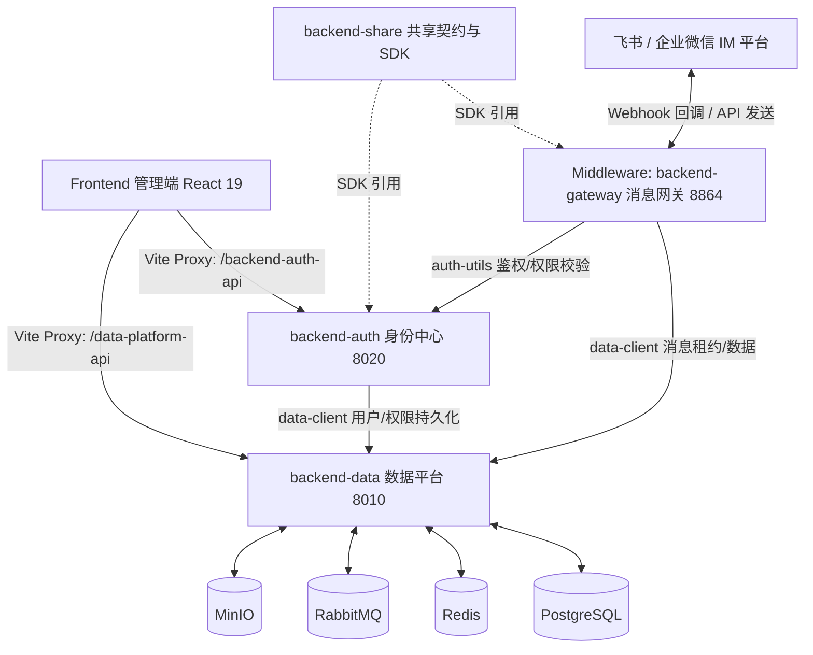
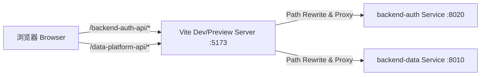
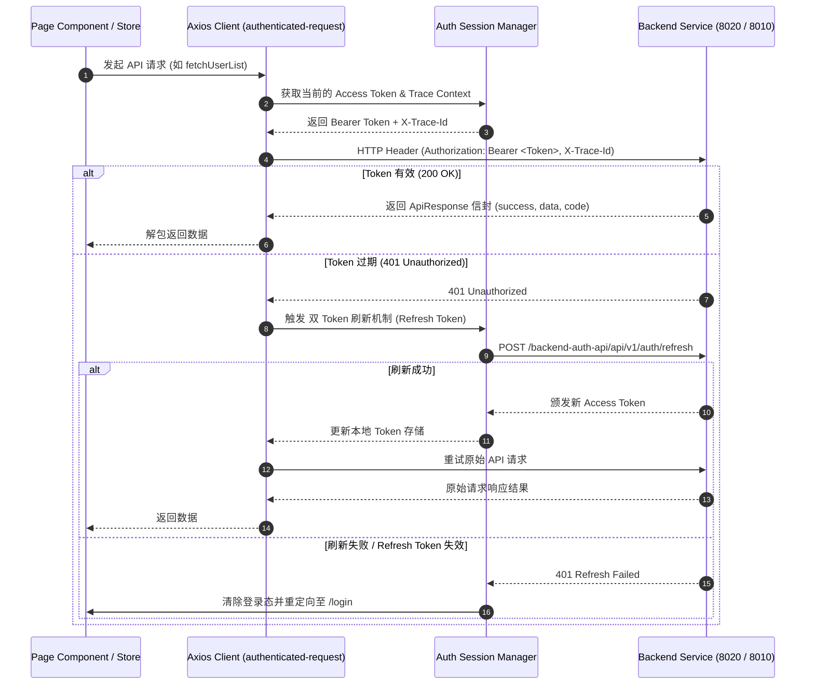
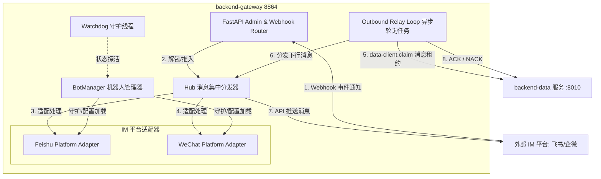
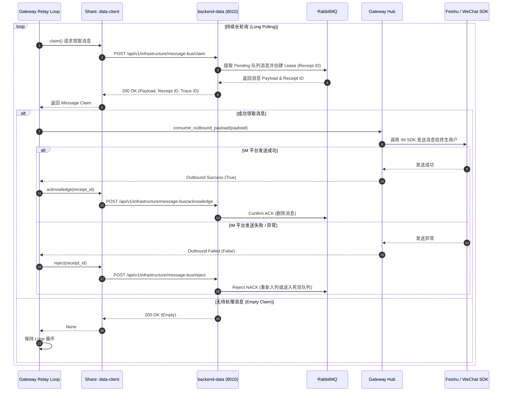
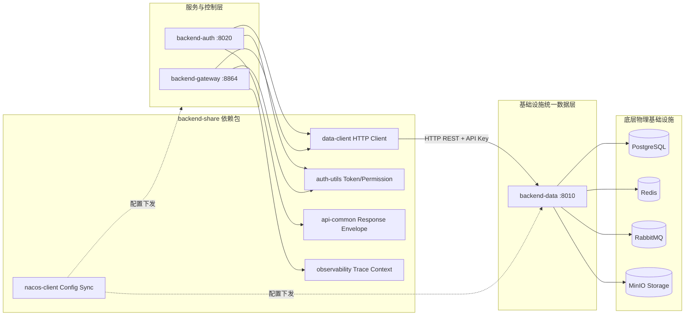
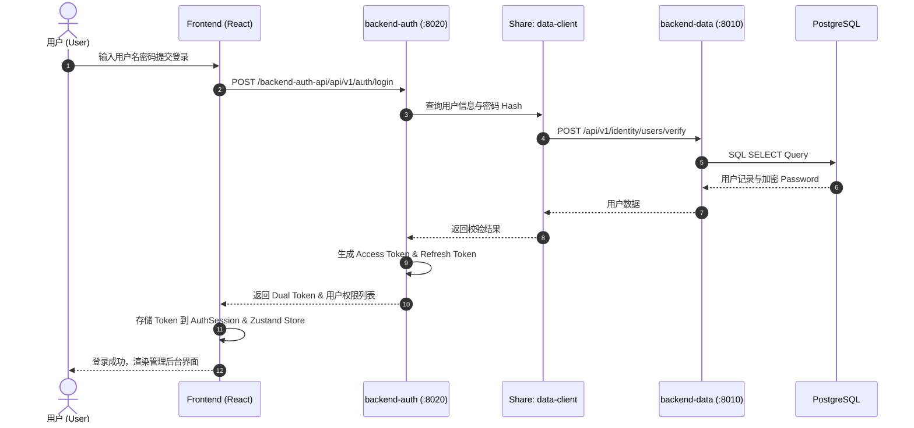
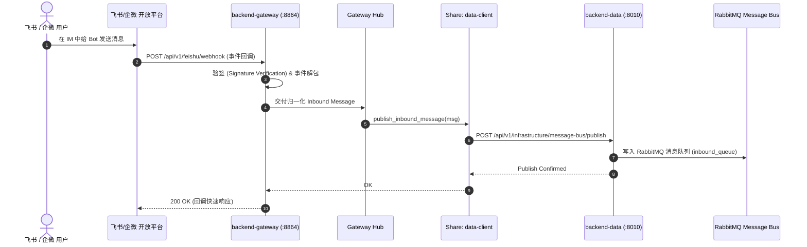

# Digital Employee - 模块调用流图

本文档为数字员工 (Digital Employee) 系统最新架构的模块调用流图与组件交互设计规范，涵盖 **前端 (Front)**、**中间件/消息网关 (Middleware / Gateway)**、**业务与数据中心 (Auth / Data)** 以及 **共享契约包 (Backend-Share)** 的完整拓扑结构与调用链路。

关于 `backend-gateway` 与 `backend-data` 的数据流向专门详解，请参阅 [data-gateway详细说明.md](file:///e:/code/digital-employee/md/data-gateway%E8%AF%A6%E7%BB%86%E8%AF%B4%E6%98%8E.md)。

关于系统用户、角色定义、细粒度权限码与鉴权拦截规范，请参阅 [用户角色权限.md](file:///e:/code/digital-employee/md/%E7%94%A8%E6%88%B7%E8%A7%92%E8%89%B2%E6%9D%83%E9%99%90.md)。

---

## 1. 总体架构拓扑与交互概览

数字员工系统采用高度解耦的微服务与数据隔离架构：

### 关键架构约束（硬边界）：
1. **基础设施隔离**：PostgreSQL、Redis、MinIO、RabbitMQ 的驱动与连接仅允许在 `backend-data` 中存在。
2. **数据契约访问**：`backend-gateway` 与 `backend-auth` 必须通过 `backend-share/data-client` HTTP SDK 访问基础设施。
3. **安全与鉴权**：服务间通过 `backend-share/auth-utils` 进行用户上下文解析与权限编码 (`PermissionCode`) 拦截，网关/身份中心通过统一 `API_KEY` 验证内部通讯。

---

## 2. 前端 (Front) 架构与 API 调用流

前端基于 React 19 + TypeScript + Vite 8 + Ant Design 6 + Axios 构建。

### 2.1 Vite 开发与预览代理流 (Proxy Layer)

- **/backend-auth-api**: 重写为 `/` 后代理至 `http://127.0.0.1:8020`，处理登录、注册、用户/角色/权限/菜单编排。
- **/data-platform-api**: 重写为 `/` 后代理至 `http://127.0.0.1:8010`，处理数据条目、仪表盘、机器人底层元数据及系统配置。

### 2.2 前端 HTTP 请求与 Token 认证流

### 2.3 前端页面与 Store/API 模块映射表

| 页面模块 (Pages) | 对应 API 模块 (`src/api/`) | Axios 客户端封装 (`src/utils/`) | 目标后端服务 |
| :--- | :--- | :--- | :--- |
| `pages/login` & `register` | `auth-api.ts` | `backend-auth-request.ts` | `backend-auth` (8020) |
| `pages/system/users` | `user-api.ts` | `backend-auth-request.ts` | `backend-auth` (8020) |
| `pages/system/roles` | `role-api.ts` | `backend-auth-request.ts` | `backend-auth` (8020) |
| `pages/system/permissions` | `permission-api.ts` | `backend-auth-request.ts` | `backend-auth` (8020) |
| `pages/system/menus` | `menu-api.ts` | `backend-auth-request.ts` | `backend-auth` (8020) |
| `pages/system/invite-codes` | `invite-code-api.ts` | `backend-auth-request.ts` | `backend-auth` (8020) |
| `pages/digital-employee/bot` | `user-api.ts` / bot endpoints | `backend-auth-request.ts` | `backend-auth` (8020) |
| `pages/data-platform-*` | data items / config APIs | `data-platform-request.ts` | `backend-data` (8010) |

---

## 3. 中间件 / 消息网关 (Middleware: backend-gateway) 模块流

`backend-gateway`（端口 8864）作为中间件与接入层，负责对外适配 IM 平台（飞书/企业微信），对内对接消息总线与底层数据服务。

### 3.1 模块内部架构

### 3.2 下行消息长轮询与 Relay 机制 (Outbound Relay Pipeline)

网关启动后通过 `lifespan` 开启异步长任务 `_outbound_relay_loop`，从 `backend-data` 长轮询领取消息租约：

---

## 4. 后端中心服务与共享包调用链路

后端由 `backend-auth`（身份控制面）、`backend-data`（基础设施数据面）以及 `backend-share`（共享 SDK）组成。

### 4.1 服务分层与职责流

### 4.2 `backend-share` 组件交互说明

- **`data-client`**:
  - 提供 `MessageBusClient` (处理 `ensure_ready`, `claim`, `acknowledge`, `reject`, `publish`)。
  - 提供 `IdentityClient` / `BotDataClient` 等微服务通讯客户端。
  - 自动在请求头注入内部认证凭证 `X-Service-API-Key`。
- **`auth-utils`**:
  - 包含全局权限码枚举 `PermissionCode` (如 `BOT_MANAGE`, `USER_MANAGE`)。
  - 提供 FastAPI 依赖项 `require_permission` 与 JWT Token 解析器。
- **`api-common`**:
  - 定义统一响应格式 `ApiResponse`（`success`, `data`, `message`, `code`）。
  - 统一异常基类 `ApiException` 及内部处理函数。
- **`observability`**:
  - 基于 ContextVar 的 `TraceContext`，在 HTTP 请求头、RabbitMQ 消息 Payload 之间无缝传递分布式 `X-Trace-Id` 与 `X-Span-Id`。

---

## 5. 核心业务场景端到端调用时序

### 场景一：用户登录与 API 鉴权调用

### 场景二：上行 IM 消息处理流 (Inbound Webhook)

---

## 6. 服务端口与通信协议一览

| 服务模块 | 运行端口 | 通信协议 | 暴露 API 路由前缀 | 主要调用方 | 说明 |
| :--- | :--- | :--- | :--- | :--- | :--- |
| `frontend` | `5173` | HTTP / HTML | `/` | 终端浏览器 | React 19 UI 开发与预览服务器 |
| `backend-gateway` | `8864` | HTTP / REST | `/api/v1/feishu`, `/api/v1/bots` | 飞书/企微 Webhook、Admin 控制台 | 消息接入网关、平台适配器与下行 Relay |
| `backend-auth` | `8020` | HTTP / REST | `/api/v1/auth`, `/api/v1/users`, `/api/v1/roles` | Frontend Proxy (`/backend-auth-api`) | 身份中心、用户与权限业务编排服务 |
| `backend-data` | `8010` | HTTP / REST | `/api/v1/identity`, `/api/v1/infrastructure` | `backend-share/data-client` (Auth/GW) | 全仓库唯一基础设施与持久化访问服务 |
