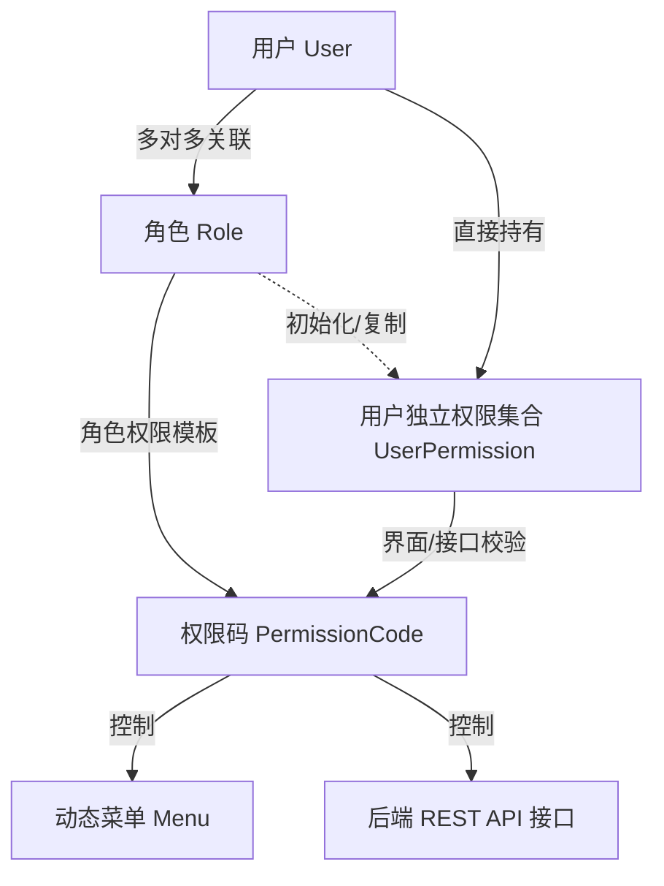
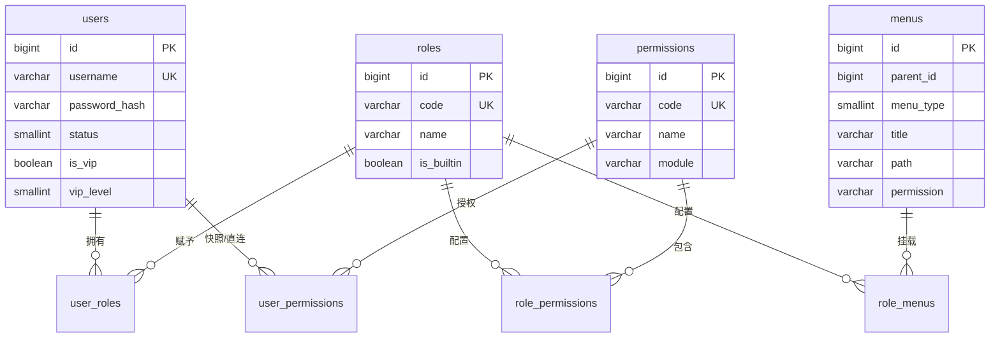
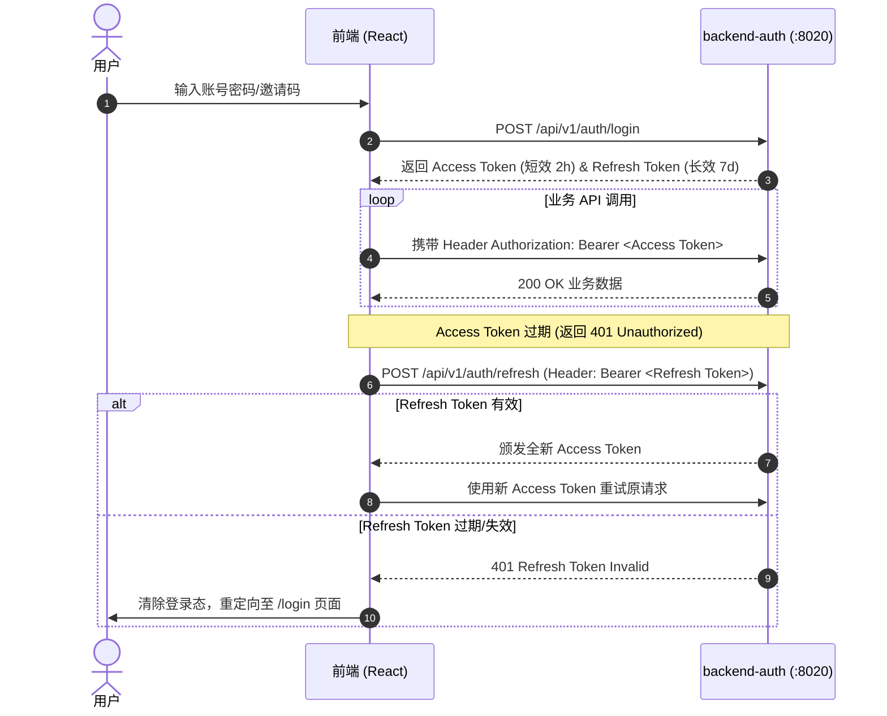

# Digital Employee - 用户角色权限规范文档

本文档详细定义了数字员工 (Digital Employee) 系统中的 **用户 (Users)**、**角色 (Roles)**、**权限码 (Permissions)**、**动态菜单 (Menus)** 以及 **双 Token 认证与鉴权模型**。

---

## 1. 权限模型设计 (RBAC 扩展架构)

系统采用 **RBAC (Role-Based Access Control) + 细粒度权限码 (Permission Code)** 的扩展混合授权架构：



### 设计核心原则：
1. **角色模板化，权限独立化**：角色 (`Role`) 作为权限模板。当给用户分配角色时，角色的权限集复制到用户的独立权限集合 (`user_permissions`) 中。这样系统既支持按角色批量授权，也支持针对特定用户进行细粒度的权限追加或撤销。
2. **双重边界控制**：
   - **最高权限旁路 (`super_admin`)**：具备全局全权限，不可被撤销。
   - **普通管理员 (`manager`)**：基于显式分配的权限码（`permission_codes`）校验，防止管理员角色的越权风险。
3. **安全拦截链**：后端在路由层通过 `require_permission("code")` 校验，前端通过 `permissions` 列表进行菜单显隐与按钮级拦截（双重防御）。

---

## 2. 数据库物理表结构与 DDL 定义

系统身份与权限中枢包含 4 张核心主表与 5 张多对多关联表：



### 2.1 用户表 (`users`)

```sql
CREATE TABLE IF NOT EXISTS users (
    id BIGSERIAL PRIMARY KEY,                          -- 物理主键 ID
    username VARCHAR(64) UNIQUE NOT NULL,               -- 登录用户名
    password_hash VARCHAR(255) NOT NULL,                -- 加密密码 Hash
    email VARCHAR(128) UNIQUE,                          -- 邮箱地址
    phone VARCHAR(32),                                  -- 手机号码
    nickname VARCHAR(64),                               -- 用户昵称
    avatar_url VARCHAR(512),                            -- 头像存储 URL
    status SMALLINT NOT NULL DEFAULT 1,                 -- 账号状态 (1: 正常, 0: 禁用)
    is_vip BOOLEAN NOT NULL DEFAULT FALSE,              -- 是否 VIP
    vip_expires_at TIMESTAMPTZ,                         -- VIP 过期时间
    vip_level SMALLINT NOT NULL DEFAULT 0,              -- VIP 等级 (如 66 代表管理员)
    last_login_at TIMESTAMPTZ,                          -- 最后登录时间
    last_login_ip VARCHAR(64),                          -- 最后登录 IP
    created_at TIMESTAMPTZ NOT NULL DEFAULT NOW(),      -- 创建时间
    updated_at TIMESTAMPTZ NOT NULL DEFAULT NOW(),      -- 更新时间
    deleted_at TIMESTAMPTZ                              -- 软删除时间戳
);
```

### 2.2 角色表 (`roles`) & 关联表 (`user_roles`)

```sql
CREATE TABLE IF NOT EXISTS roles (
    id BIGSERIAL PRIMARY KEY,                          -- 角色 ID
    code VARCHAR(64) UNIQUE NOT NULL,                   -- 角色编码 (super_admin / manager / operator)
    name VARCHAR(64) NOT NULL,                          -- 角色名称
    description VARCHAR(255) NOT NULL DEFAULT '',       -- 角色描述
    is_builtin BOOLEAN NOT NULL DEFAULT FALSE,          -- 是否内置角色 (内置角色不可删除)
    created_at TIMESTAMPTZ NOT NULL DEFAULT NOW(),      -- 创建时间
    deleted_at TIMESTAMPTZ                              -- 软删除时间戳
);

-- 用户与角色多对多关联表
CREATE TABLE IF NOT EXISTS user_roles (
    user_id BIGINT REFERENCES users(id) ON DELETE CASCADE,
    role_id BIGINT REFERENCES roles(id) ON DELETE CASCADE,
    PRIMARY KEY (user_id, role_id)
);
```

### 2.3 权限码表 (`permissions`) & 关联表

```sql
CREATE TABLE IF NOT EXISTS permissions (
    id BIGSERIAL PRIMARY KEY,                          -- 权限 ID
    code VARCHAR(128) UNIQUE NOT NULL,                  -- 权限码 (如 admin:user:manage)
    name VARCHAR(64) NOT NULL,                          -- 权限名称
    description VARCHAR(255) NOT NULL DEFAULT '',       -- 权限描述
    module VARCHAR(32),                                 -- 所属模块 (如 user / bot / data_platform)
    created_at TIMESTAMPTZ NOT NULL DEFAULT NOW()       -- 创建时间
);

-- 角色与权限关联表
CREATE TABLE IF NOT EXISTS role_permissions (
    role_id BIGINT REFERENCES roles(id) ON DELETE CASCADE,
    permission_id BIGINT REFERENCES permissions(id) ON DELETE CASCADE,
    PRIMARY KEY (role_id, permission_id)
);

-- 用户独立权限集合表 (由角色复制或直接针对用户追加/撤销)
CREATE TABLE IF NOT EXISTS user_permissions (
    user_id BIGINT REFERENCES users(id) ON DELETE CASCADE,
    permission_id BIGINT REFERENCES permissions(id) ON DELETE CASCADE,
    PRIMARY KEY (user_id, permission_id)
);
```

### 2.4 动态菜单表 (`menus`) & 关联表

```sql
CREATE TABLE IF NOT EXISTS menus (
    id BIGSERIAL PRIMARY KEY,                          -- 菜单 ID
    parent_id BIGINT NOT NULL DEFAULT 0,                -- 父级 ID (0 表示顶级菜单)
    menu_type SMALLINT NOT NULL,                        -- 菜单类型 (1: 目录, 2: 菜单, 3: 按钮)
    title VARCHAR(64) NOT NULL,                         -- 菜单标题
    path VARCHAR(255),                                  -- 路由路径 (如 /digital-employee/bots)
    component VARCHAR(255),                             -- 前端组件路径 (如 digital-employee/bot)
    icon VARCHAR(64),                                   -- 菜单图标名称 (AntD Icon)
    permission VARCHAR(128),                            -- 绑定权限码 (空表示仅登录可见)
    sort INT NOT NULL DEFAULT 0,                        -- 排序权重
    visible BOOLEAN NOT NULL DEFAULT TRUE,              -- 是否可见
    created_at TIMESTAMPTZ NOT NULL DEFAULT NOW(),      -- 创建时间
    updated_at TIMESTAMPTZ NOT NULL DEFAULT NOW(),      -- 更新时间
    deleted_at TIMESTAMPTZ                              -- 软删除时间戳
);

-- 角色与菜单关联表
CREATE TABLE IF NOT EXISTS role_menus (
    role_id BIGINT REFERENCES roles(id) ON DELETE CASCADE,
    menu_id BIGINT REFERENCES menus(id) ON DELETE CASCADE,
    PRIMARY KEY (role_id, menu_id)
);
```

---

## 3. 核心角色体系 (Roles)

系统内置预设角色及其等级划分如下：

| 角色 Code | 角色名称 | VIP 等级 | 说明与作用域 | 权限来源 |
| :--- | :--- | :--- | :--- | :--- |
| `super_admin` | 超级管理员 | `99` | 拥有系统无限制全局最高控制权；可重置用户密码、分配任意角色与菜单 | 内置全权限旁路 (`FULL_ACCESS_ROLE_CODES`) |
| `manager` | 系统管理员 | `66` | 具备运营/运维管理能力，可管理业务数据、Bot 机器人与邀请码 | 按绑定的 `permission_codes` 显式校验 |
| `operator` | 业务操作员 | `10` | 普通运营人员，可查看数据平台看板、检索业务数据与日志 | 仅授予基础读权限 |
| `user` | 普通用户 | `1` | 默认注册/邀请加入的基础账号，仅能使用基本功能 | 默认基础权限集 |

---

## 3. 全局内置权限码全表 (Permission Codes)

所有的权限码定义于 `backend-share/auth-utils` 的 `PermissionCode` 枚举中，并在数据库 `permissions` 表中持久化，提供跨服务的统一安全契约：

| 权限码 (Permission Code) | 模块归属 | 权限说明 | 影响的 API 接口 / 菜单路由 |
| :--- | :--- | :--- | :--- |
| `admin:user:manage` | 身份中心 | 用户列表查询、账号启用/禁用、密码重置、基础信息修改 | `GET/POST/PUT/DELETE /api/v1/users` |
| `admin:user:readonly` | 身份中心 | 用户列表只读查看，不可增删改 | `GET /api/v1/users` |
| `admin:permission:manage` | 身份中心 | 角色创建与修改、角色权限点分配、用户角色授权 | `GET/POST/PUT/DELETE /api/v1/roles`, `/api/v1/permissions` |
| `admin:permission:readonly` | 身份中心 | 角色与授权信息只读查看，不可修改 | `GET /api/v1/roles`, `GET /api/v1/permissions` |
| `admin:invite_code:manage` | 身份中心 | 注册邀请码的生成、查询、失效处理 | `GET/POST/DELETE /api/v1/invite-codes` |
| `admin:invite_code:readonly` | 身份中心 | 邀请码列表只读查看，不可增删改 | `GET /api/v1/invite-codes` |
| `admin:menu:manage` | 身份中心 | 动态菜单项增删改查、菜单路由与权限码绑定 | `GET/POST/PUT/DELETE /api/v1/menus` |
| `admin:menu:readonly` | 身份中心 | 菜单项只读查看，不可增删改 | `GET /api/v1/menus` |
| `admin:bot:manage` | 数字员工 | IM 机器人接入配置、AppID/AppSecret 凭证更新、网关探活 | `GET/POST/PUT/DELETE /api/v1/bots` |
| `admin:bot:readonly` | 数字员工 | 机器人列表只读查看，不可增删改 | `GET /api/v1/bots` |
| `admin:agent:manage` | 数字员工 | Agent 定义与生命周期管理 | `GET/POST/PUT/DELETE /api/v1/agents` |
| `admin:agent:readonly` | 数字员工 | Agent 列表只读查看，不可增删改 | `GET /api/v1/agents` |
| `admin:data_platform:dashboard` | 数据平台 | 数据平台仪表盘与系统统计数据查看 | `GET /api/v1/data-items/stats` |
| `admin:data_platform:data_items` | 数据平台 | 数据平台业务数据条目 CRUD 操作 | `GET/POST/PUT/DELETE /api/v1/data-items` |
| `admin:data_platform:config` | 数据平台 | 数据平台全局环境变量与参数配置 | `GET/PUT /api/v1/system-config` |
| `admin:observability:log:view` | 可观测性 | 分布式链路日志与系统运行 Log 查看 | `GET /api/v1/observability/logs` |

> **读写分级约定**：每个管理模块拆分为 `manage`（管理：读 + 写）与 `readonly`（只读：仅查看）两级权限码。
> 后端 GET（读）接口同时接受 `manage` 与 `readonly`（OR 语义）；POST/PUT/DELETE（写）接口仅接受 `manage`。
> 前端在只读权限下隐藏所有新建/编辑/删除等写操作入口，仅保留查看与刷新能力。
>
> **菜单可见性约定**：管理菜单的 `menus.permission` 字段绑定 `readonly` 码（最低可见权限）。
> `manage` 是 `readonly` 的超集——持有 `xxx:manage` 的用户同样能看到绑 `xxx:readonly` 的菜单
> （由 `backend-data` 的 `expand_manage_to_readonly` 统一处理）。因此：
> - 分配管理菜单给角色 → 角色自动获得对应的 `readonly` 权限码（只读）
> - 授予 `manage` 权限码 → 通过「用户独立权限分配」单独授予（角色模板不自动授予 manage）
>
> **数据迁移影响**：菜单 `permission` 从 `xxx:manage` 改为 `xxx:readonly` 后，重新执行菜单分配
> 会把既有角色的权限码从 `manage` 同步降级为 `readonly`。上线时需先为需要写权限的账号
> 通过用户独立权限分配补授 `manage` 权限码，避免管理员失去写操作能力。

---

## 4. 认证与双 Token 鉴权机制 (Dual Token Authentication)

身份中心 (`backend-auth`) 采用 **Dual Token (双令牌)** 机制保障系统安全性与体验：



### 4.1 Token 结构与 Payload 声明
`access_token` 中封装了用户的安全上下文声明：
```json
{
  "sub": "user_id_10001",
  "username": "admin",
  "roles": ["super_admin"],
  "permissions": [
    "admin:user:manage",
    "admin:bot:manage",
    "admin:data_platform:dashboard"
  ],
  "must_change_password": false,
  "exp": 1754070000
}
```

### 4.2 强制修改密码规则 (`must_change_password`)
- 当管理员通过后台重置某个用户的密码，或用户通过一次性邀请码注册时，系统会将 `must_change_password` 标记设为 `true`。
- 后端中间件与依赖拦截器 `require_permission` 会首先检查此标记：若为 `true`，则直接抛出 `PermissionDeniedError("请先修改管理员重置的临时密码")` 并阻断访问。
- 用户必须先成功调用 `PUT /api/v1/auth/password` 修改密码后，方可解除拦截。

---

## 5. API 路由鉴权拦截机制

后端在 FastAPI 中提供三个层次的依赖项拦截（定义于 `backend-auth/app/api/deps.py`）：

### 5.1 服务间 API Key 拦截 (`verify_api_key`)
- 校验请求头 `X-API-Key` 是否与系统设定的 `API_KEY` 一致。
- 用于保护网关与后端微服务之间的内部通讯接口，防止未授权外部调用。

### 5.2 用户登录鉴权 (`get_current_user`)
- 提取并解析请求头 `Authorization: Bearer <token>`。
- 校验 Token 签名合法性与过期时间，确认用户处于启用状态（非 `disabled`）。

### 5.3 细粒度权限码拦截 (`require_permission`)
在路由定义处添加依赖拦截，例如：
```python
@router.get(
    "/bots",
    dependencies=[Depends(require_permission(PermissionCode.BOT_MANAGE))],
)
def list_bots():
    ...
```
- **校验逻辑**：
  1. 若用户包含 `super_admin` 角色 $\to$ **直接放行 (Pass-through)**。
  2. 若用户 `must_change_password == True` $\to$ **拒绝访问**。
  3. 检查用户的 `permissions` 集合中是否包含要求的权限码（支持传入多个权限码，满足其一即放行）。

---

## 6. 前端动态菜单与按钮级权限控制

前端根据登录后获取的用户信息（`roles`, `permissions`, `menus`）进行双重控制：

1. **路由与菜单显隐 (Router & Menu Filter)**：
   - 动态菜单 API (`/api/v1/menus`) 返回当前用户允许查看的菜单树结构。
   - 路由守卫根据菜单中的 `permission` 字段与用户持有的 `permissions` 匹配，无权限的路由禁止跳转并重定向至 403 页面。
2. **按钮/操作细粒度控制 (UI Component Protection)**：
   - 前端提供 `PermissionGuard` 权限保护组件与 `useHasPermission` Hook：
   ```tsx
   // 示例：仅当拥有 BOT_MANAGE 权限时渲染添加机器人按钮
   <PermissionGuard code="admin:bot:manage">
     <Button type="primary">新增机器人</Button>
   </PermissionGuard>
   ```
